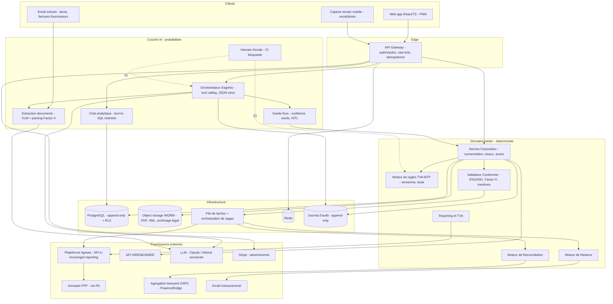

# Assistant IA de facturation électronique — Analyse stratégique, technique et critique

> Document de travail. Rédigé le 26/07/2026.
> Posture : **investisseur sceptique + CTO**. L'objectif n'est pas de valider l'idée, c'est de trouver la version de l'idée qui survit.
>
> ⚠️ Tous les chiffres réglementaires et de marché sont des ordres de grandeur à re-vérifier auprès des sources primaires (impots.gouv.fr, INSEE, Altares) avant toute décision d'investissement ou de communication commerciale.

---

## SOMMAIRE

1. [Verdict investisseur](#1-verdict-investisseur)
2. [Le contexte a changé : où on en est vraiment en juillet 2026](#2-le-contexte-a-changé--où-on-en-est-vraiment-en-juillet-2026)
3. [Réalisme : ce qui est facile, difficile, et très difficile](#3-réalisme--ce-qui-est-facile-difficile-et-très-difficile)
4. [Le piège fatal : l'interface conversationnelle prise pour un produit](#4-le-piège-fatal--linterface-conversationnelle-prise-pour-un-produit)
5. [Analyse concurrentielle détaillée](#5-analyse-concurrentielle-détaillée)
6. [L'angle différenciant : 5 candidats, 1 recommandation](#6-langle-différenciant--5-candidats-1-recommandation)
7. [MVP réalisable en 3 mois](#7-mvp-réalisable-en-3-mois)
8. [Architecture technique complète](#8-architecture-technique-complète)
9. [Modèles de données](#9-modèles-de-données)
10. [API](#10-api)
11. [Les agents IA](#11-les-agents-ia)
12. [Écrans de l'application](#12-écrans-de-lapplication)
13. [Intégration de la réglementation française](#13-intégration-de-la-réglementation-française)
14. [Business model et tarification](#14-business-model-et-tarification)
15. [Coût de développement](#15-coût-de-développement)
16. [Potentiel de marché : France puis Europe](#16-potentiel-de-marché--france-puis-europe)
17. [Fonctionnalités que les concurrents n'ont pas](#17-fonctionnalités-que-les-concurrents-nont-pas)
18. [Feuille de route 24 mois](#18-feuille-de-route-24-mois)
19. [Stratégie : les 100 premiers clients](#19-stratégie--les-100-premiers-clients)
20. [Critique sévère : 16 faiblesses et leurs correctifs](#20-critique-sévère--16-faiblesses-et-leurs-correctifs)
21. [Kill criteria](#21-kill-criteria)
22. [Ce que je ferais cette semaine](#22-ce-que-je-ferais-cette-semaine)

---

## 1. Verdict investisseur

### Note

| Thèse | Note | Commentaire |
|---|---|---|
| « Assistant IA généraliste de facturation pour toutes les entreprises » (ton idée telle qu'écrite) | **3,5 / 10** | Non finançable. Marché en cours de raflage par un acteur à 3,5 Md€ qui a déjà livré la même promesse, sur un produit commoditisé, avec un wedge (le chat) qui n'est pas une douleur. |
| « Back-office autonome vertical (BTP/artisanat) branché sur une Plateforme Agréée, distribué via les cabinets » (ma recommandation) | **7 / 10** | Finançable en pre-seed. Fenêtre de 13 mois. Moat construit sur la connaissance métier + les données de paiement, pas sur le LLM. |

### Ce qu'un investisseur va te dire en 90 secondes

> « Tu me décris Pennylane avec un chat. Pennylane a 175 M€ en banque depuis janvier, une immatriculation Plateforme Agréée définitive, 4 000+ cabinets d'expertise comptable dans son réseau, et des agents IA en production depuis dix mois. Qonto a 500 000 clients et a racheté Regate. Cegid fait ~1 Md€ de CA et est adossé à KKR/Silver Lake. Toi tu as une idée et un compte Lovable. Explique-moi pourquoi tu gagnes. »

Et il aura raison. La question n'est pas « est-ce que le marché existe » — il existe et il est énorme. La question est **« pourquoi toi, pourquoi maintenant, pourquoi ne te copient-ils pas en un trimestre »**. Le chat vocal se copie en trois semaines par une équipe de deux personnes chez Pennylane. Ce n'est pas un avantage concurrentiel, c'est une feature de démo.

### Ce qui rend l'idée investissable

Trois déplacements, tous nécessaires, aucun optionnel :

1. **Du généraliste au vertical.** Ne vends pas « la facturation » (commodité, gratuite chez Henrri/Facture.net, incluse chez Qonto, offerte par les banques). Vends « la conformité TVA et le cash du BTP », où les règles sont si complexes que même les experts-comptables se trompent.
2. **Du chat à l'agent autonome en tâche de fond.** Le produit ne doit pas attendre qu'on lui parle. Il doit avoir déjà fait le travail quand tu ouvres l'app. Le chat est l'exception (question ponctuelle), pas le mode d'usage principal.
3. **De l'acquisition directe au canal.** Le CAC direct sur une TPE à 39 €/mois est structurellement mortel en France. Le canal expert-comptable / fédération professionnelle / éditeur métier est le seul chemin viable sous 2 M€ de levée.

### La bonne nouvelle, sérieusement

Il y a **une fenêtre de timing réelle et rare**, et elle est ouverte maintenant :

- Depuis le **1er septembre 2026 (dans 5 semaines)**, *toutes* les entreprises françaises — y compris les 2,5 millions de micro-entreprises — doivent être capables de **recevoir** une facture électronique via une plateforme. La majorité des TPE n'a rien fait.
- Le **1er septembre 2027**, ces mêmes TPE/PME devront **émettre** en électronique et faire de l'e-reporting. Elles ont 13 mois, et elles vont toutes chercher une solution dans les 6 derniers mois.
- Les incumbents (Pennylane, Cegid, Sage) sont structurellement tournés vers **le cabinet d'expertise comptable et la PME de 10-250 salariés**. Le maçon de 3 salariés à Chalon-sur-Saône n'est pas leur ICP, il est mal servi, et il représente le plus gros volume d'entreprises du pays.

C'est là que se trouve ton entreprise. Pas dans « un ChatGPT qui fait des factures ».

---

## 2. Le contexte a changé : où on en est vraiment en juillet 2026

Tu dois construire sur les faits de juillet 2026, pas sur ceux de 2023. Ce qui suit est le socle factuel.

### 2.1 Le calendrier réglementaire (confirmé, pas de report)

| Date | Obligation | Périmètre |
|---|---|---|
| **1er sept. 2026** | **Réception** de factures électroniques | **Toutes** les entreprises assujetties à la TVA en France, sans exception de taille |
| 1er sept. 2026 | **Émission** + e-reporting | Grandes entreprises (GE) et ETI |
| **1er sept. 2027** | **Émission** + e-reporting | **PME et micro-entreprises** (dont auto-entrepreneurs) |
| 1er sept. 2027 | Émission + e-reporting | Entreprises non établies en France mais immatriculées à la TVA française |

Le cap du 1er septembre 2026 a été **confirmé** — les tentatives de report par voie d'amendement n'ont pas abouti. Traite le calendrier comme ferme, mais garde une clause de flexibilité dans ta roadmap : un glissement de 6 mois du volet 2027 est un risque politique non nul, et il décalerait ta courbe de revenus d'autant.

### 2.2 Changement majeur d'architecture réglementaire (souvent mal compris)

Deux choses ont changé depuis les premières versions de la réforme, et elles sont **structurantes pour ton business model** :

**(a) Le Portail Public de Facturation (PPF) n'est plus une plateforme d'échange gratuite.** Depuis la révision d'octobre 2024, le PPF se limite à deux rôles : **annuaire** (routage des factures vers la bonne plateforme, via SIREN/SIRET + code routage) et **concentrateur** de données vers la DGFiP. Il n'y a **pas d'option gratuite** pour transmettre ses factures. Conséquence commerciale immense : **4 millions d'entreprises doivent souscrire à un service payant**. C'est le plus grand événement d'acquisition forcée de l'histoire du logiciel B2B français.

**(b) Le vocabulaire a changé.** Mi-2025, la DGFiP a renommé les **PDP (Plateformes de Dématérialisation Partenaires)** en **PA (Plateformes Agréées)**. Et les anciens **OD (Opérateurs de Dématérialisation)** deviennent des **SC (Solutions Compatibles)**. Utilise le vocabulaire 2026 dans tes documents commerciaux — les experts-comptables repèrent immédiatement quelqu'un qui parle en vocabulaire 2023.

### 2.3 Les deux statuts possibles pour toi — décision fondatrice

| | **Plateforme Agréée (PA)** | **Solution Compatible (SC, ex-OD)** |
|---|---|---|
| Peut transmettre directement à l'annuaire/DGFiP | ✅ Oui | ❌ Non — doit passer par une PA |
| Immatriculation DGFiP | Obligatoire, valable 3 ans | Aucune |
| Prérequis | Dossier DGFiP, audit, **ISO 27001** (ou équivalent), tests d'interopérabilité avec le PPF, hébergement UE, capacités Factur-X/UBL/CII, gestion des cycles de vie | Aucun formalisme |
| Délai réaliste d'obtention | **9 à 18 mois** + 60-150 k€ | 0 |
| Marge | Tu captes toute la valeur de transport | Tu paies un péage à la PA |

**Ma recommandation, sans ambiguïté : démarre en Solution Compatible adossée à une PA existante, via API.** Devenir PA maintenant est une erreur de séquençage — tu brûlerais 12 mois et 150 k€ sur de l'infrastructure de commodité pendant que ton concurrent construit du produit.

Il y a déjà **~137 PA immatriculées** (chiffre DGFiP de juin 2026 : plus de 130). C'est une commodité en surcapacité, donc en guerre de prix — exactement ce que tu veux acheter, pas ce que tu veux vendre. Certaines proposent explicitement de la **marque blanche / API-first** (Seqino, Iopole, b2brouter, Docaposte, Libeo, Esker, Generix). Négocie avec 3 d'entre elles.

Point de vigilance juridique : **ne dis jamais « nous sommes une plateforme agréée » si tu ne l'es pas.** Formulation correcte : *« Solution compatible, interconnectée à la plateforme agréée X (immatriculée DGFiP n° …) »*. Une PME qui découvre que tu as menti sur ce point te quitte, et le dénonce sur LinkedIn.

Prévois néanmoins la PA en **Année 2-3** : quand tu passes 3-5 M€ de factures transmises par an, le péage devient supérieur au coût d'internalisation, et l'immatriculation devient un actif défensif (et un argument de vente auprès des ETI). Architecture-toi dès le départ pour que le connecteur PA soit **remplaçable** (voir §8).

### 2.4 L'état du marché IA-compta en France

- **3,2 Md€ investis dans la ComptaTech française entre 2019 et 2025**, six licornes (Cegid, Pennylane, Qonto, PayFit, Spendesk, Septeo).
- **Pennylane** : 175 M€ levés en janvier 2026 (TCV, Blackstone Growth), **valorisation 3,5 Md€** (contre 2 Md€ en avril 2025). Immatriculation PA définitive le 11/12/2025. **Agents IA en production depuis le 1er septembre 2025** (réconciliation bancaire, catégorisation des dépenses).
- Les fonctionnalités que tu décris comme différenciantes — « quel est mon CA du mois », « quels clients ne m'ont pas payé », réconciliation automatique — **existent déjà en production chez plusieurs acteurs**.

**Conclusion de cette section : tu n'arrives pas sur un marché vierge, tu arrives au milieu d'une bataille déjà capitalisée à 3 Md€.** Ça ne veut pas dire « n'y va pas ». Ça veut dire « n'y va pas frontalement, et n'y va pas avec une feature ».

---

## 3. Réalisme : ce qui est facile, difficile, et très difficile

Le principal risque d'un fondateur non-comptable sur ce sujet est de **sous-estimer massivement la longue traîne réglementaire**. Voici la carte honnête.

### 3.1 Facile (1 à 3 semaines chacun) — ~15 % de l'effort

| Brique | Pourquoi c'est facile |
|---|---|
| NLU : « facture 4 500 € pour Dupont » → JSON structuré | Un LLM moderne avec un schéma JSON strict le fait à ~98 % dès le premier essai |
| Génération PDF de facture | Bibliothèques matures |
| Génération d'un XML Factur-X profil MINIMUM/BASIC | Spécifications publiques, libs open source (mustangproject en Java, php-factur-x, factur-x en Python) |
| Dashboard CA / encours / top clients | SQL |
| Chat « pose-moi une question sur mes données » | Text-to-SQL sur un schéma restreint + garde-fous |
| Envoi d'emails de relance | Commodité |

**C'est cette couche qui produit la démo qui impressionne.** C'est aussi celle qui n'a aucune valeur défensive. Tu la finiras en 3 semaines et tu croiras avoir fait 60 % du travail. Tu auras fait 15 %.

### 3.2 Difficile (1 à 3 mois chacun) — ~45 % de l'effort

| Brique | Le piège |
|---|---|
| **Cycle de vie de la facture** | La réforme impose des **statuts obligatoires** à gérer et remonter (déposée, rejetée, refusée, encaissée, mise à disposition…). Ce sont des événements **asynchrones**, qui arrivent des heures ou des jours plus tard, dans un ordre non garanti, avec des rejets à traiter. C'est une machine à états distribuée. **C'est ici que part le plus gros du dev backend, et personne ne l'anticipe.** |
| **Validation EN 16931 / Factur-X** | Il ne suffit pas de produire un XML. Il doit passer les règles Schematron EN 16931 + le CIUS français + les règles métier de la PA. Des centaines de règles. Une facture rejetée = un client furieux. |
| **Annuaire et routage** | Pour envoyer une facture, il faut savoir sur *quelle plateforme* est ton client. Il faut interroger l'annuaire, gérer les codes de routage, gérer les clients absents de l'annuaire, gérer les changements de plateforme. |
| **Réconciliation bancaire** | Agrégation bancaire (Powens/Bridge/Tink/GoCardless — DSP2, coût réel, consentements à renouveler tous les 90-180 jours), puis lettrage : paiements partiels, groupés, escomptes, écarts de centimes, virements sans référence, prélèvements. |
| **Ingestion des factures fournisseurs** | Factur-X → extraction XML fiable ; PDF classique → VLM ; papier → OCR. Trois pipelines, trois niveaux de confiance. |
| **e-reporting** | Flux agrégés périodiques (transactions B2C, opérations internationales, données de paiement pour les assujettis à la TVA sur encaissements), selon les spécifications externes DGFiP (v3.x). Ce n'est pas le même flux que l'e-invoicing, et ça se plante silencieusement. |
| **Piste d'audit fiable + inaltérabilité** | Numérotation chronologique sans rupture, non-modification après émission, journalisation, archivage. Contraintes qui **interdisent** l'`UPDATE` naïf sur ta table `invoices`. |

### 3.3 Très difficile (le vrai fossé) — ~40 % de l'effort, et c'est là qu'est le moat

| Brique | Pourquoi c'est très difficile |
|---|---|
| **Le moteur de règles TVA** | Voir §3.4. C'est le cœur du produit et la source de ton avantage. |
| **La fiabilité exigée** | En comptabilité, 95 % de justesse = produit inutilisable. Le seuil psychologique est ~100 %, ou alors *une incertitude explicitement signalée*. Un LLM qui se trompe silencieusement une fois sur vingt détruit la confiance définitivement. |
| **L'évaluation continue** | Tu as besoin d'un harnais d'évals (jeu doré de plusieurs centaines de cas réels, exécuté en CI, bloquant au merge) sinon chaque amélioration de prompt casse silencieusement autre chose. C'est de l'infrastructure de qualité, pas du prompt engineering. |
| **La responsabilité** | Si ton IA applique 20 % au lieu de 10 % sur 200 factures de rénovation, qui paie le redressement ? Voir §20.6. |

### 3.4 Le cas de la TVA : pourquoi ton exemple est plus dur qu'il n'y paraît

Reprenons littéralement ta requête : *« Crée une facture pour le client Dupont de 4 500 € HT concernant les travaux réalisés cette semaine. »*

Pour être conforme, il faut résoudre :

1. **Quel taux ?** 20 % (neuf, standard) / 10 % (travaux d'amélioration, transformation, aménagement, entretien sur logement achevé depuis + de 2 ans) / 5,5 % (travaux de rénovation énergétique éligibles) / 0 % applicable ? Le taux dépend de la **nature des travaux**, de l'**âge du logement**, de l'**usage** (habitation ou non), et de la présence d'une **attestation client** (Cerfa 1300-SD simplifiée). L'IA ne peut pas déduire ça de « les travaux réalisés cette semaine ».
2. **Autoliquidation ?** Si Dupont est un donneur d'ordre et que tu es sous-traitant sur un chantier de bâtiment, l'article 283-2 nonies du CGI impose **l'autoliquidation** : tu factures **HT**, sans TVA, avec la mention *« Autoliquidation »*. Se tromper ici est un classique du redressement.
3. **Dupont est-il assujetti ?** B2B → e-invoicing. Particulier → **pas** de facture électronique obligatoire, mais **e-reporting**. Deux chemins techniques totalement différents, à partir d'une phrase identique.
4. **Franchise en base ?** Si l'émetteur est en franchise : mention *« TVA non applicable, art. 293 B du CGI »*.
5. **Régime TVA** : sur les débits ou sur les encaissements ? Ça change la mention obligatoire **et** ton flux d'e-reporting (données de paiement).
6. **Est-ce une situation de travaux ou une facture définitive ?** Retenue de garantie de 5 % à déduire ? Compte prorata ? Avance forfaitaire à rembourser ? Acompte déjà facturé à imputer ?
7. **Les 4 nouvelles mentions obligatoires depuis le 1er sept. 2026** : SIREN du client, **catégorie de l'opération** (livraison de biens / prestation de services / mixte), mention de l'**option TVA sur les débits** le cas échéant, **adresse de livraison** si différente de l'adresse de facturation.

**Voici le point le plus important de tout ce document :**

> Un LLM généraliste ne doit **jamais** décider de ces sept points par inférence probabiliste. Il doit **extraire l'intention**, puis **poser les 2 ou 3 questions manquantes**, puis passer la main à un **moteur de règles déterministe, versionné, testé, auditable**.

Et c'est une excellente nouvelle stratégique : **ce moteur de règles est ton moat.** Il n'est pas copiable en trois semaines. Il encode du savoir métier que Pennylane, horizontal et passant par les cabinets, n'a pas intérêt à construire pour le BTP. Il s'améliore avec chaque client, chaque rejet, chaque contrôle fiscal évité. Un LLM, non — un LLM est une commodité que tout le monde loue au même prix.

---

## 4. Le piège fatal : l'interface conversationnelle prise pour un produit

Je démonte ici l'hypothèse centrale de ton idée, parce que c'est la plus dangereuse.

### 4.1 Le calcul de la douleur

Une TPE émet en médiane **5 à 30 factures par mois**. Créer une facture dans Axonaut ou Henrri prend **40 à 60 secondes** avec un client existant (autocomplétion, produits enregistrés, duplication de la facture précédente).

| | Formulaire | Chat/vocal |
|---|---|---|
| Temps par facture | ~45 s | ~20 s + le temps des questions de clarification |
| Sur 20 factures/mois | 15 min | ~8 min (au mieux) |
| **Gain mensuel** | — | **~7 minutes** |

**Personne ne paie 39 €/mois pour gagner 7 minutes par mois.** Et pire : le formulaire donne une **certitude visuelle** (je vois les montants, la TVA, le client), le chat introduit une **charge de vérification** (« est-ce qu'il a bien compris 4 500 HT et pas TTC ? »). Sur un objet financier, la vérification annule le gain. C'est pour ça que les banques n'ont jamais remplacé leurs formulaires de virement par du chat.

### 4.2 L'asymétrie du coût de l'erreur

Une facture erronée en régime de facturation électronique obligatoire ne se corrige pas par un `UPDATE`. Il faut : émettre une **facture d'avoir**, la transmettre, émettre une nouvelle facture, la transmettre, gérer les statuts des trois documents, expliquer au client. **Coût réel d'une erreur : 20-40 minutes + une entaille dans la relation client.**

Espérance de gain : 7 min/mois. Espérance de perte sur une erreur par trimestre : 30 min. **L'espérance nette du chat comme mode de saisie principal est négative.**

### 4.3 Le vocal, spécifiquement

Le vocal est séduisant en démo et brutal en production :
- Les noms propres de clients et les montants sont précisément ce que la reconnaissance vocale rate le plus (« Dupont / Dupond / Dupuis », « quatre mille cinq cents / quarante-cinq cents »).
- L'environnement d'usage réel de l'artisan (chantier, camionnette, vent, machines) est le pire cas pour l'ASR.
- Toute erreur sur un montant est catastrophique et silencieuse.

**Le vocal n'est pas inutile — il est mal placé.** Il est excellent en **capture de terrain** (« j'ai passé 6 heures chez Dupont aujourd'hui, posé 12 m² de carrelage ») où l'erreur est rattrapable et le contexte (chantier, bureau) rend le clavier pénible. Il est mauvais en **acte d'émission financière**. Voir §17.1.

### 4.4 Ce que le chat *doit* être dans ton produit

| Usage | Verdict |
|---|---|
| Saisir une facture | ❌ Garde le formulaire, avec pré-remplissage intelligent |
| Poser une question analytique (« quels clients ne m'ont pas payé ? », « combien de TVA ce mois ? ») | ✅ **Excellent** — requêtes ad hoc infinies, un formulaire ne peut pas les couvrir |
| Demander une action groupée (« relance tous les clients en retard de plus de 30 jours sauf Martin ») | ✅ **Excellent** — combinatoire trop large pour une UI |
| Comprendre une règle (« pourquoi tu as mis 10 % ici ? ») | ✅ **Excellent, et c'est là que le LLM crée le plus de valeur** — l'explicabilité |
| Capturer du terrain (heures, matériaux, avancement) | ✅ Bon, en vocal |

**Reformulation du produit :** ce n'est pas « un chat qui fait des factures ». C'est **« un back-office qui travaille tout seul, et à qui on peut parler »**. La différence n'est pas cosmétique : elle change le point d'entrée du produit, la démo, le pitch, et la métrique nord.

**Métrique nord recommandée : « % de factures émises sans qu'un humain ait saisi quoi que ce soit »** (à partir d'un devis signé, d'un pointage, d'un contrat récurrent, d'un bon de livraison). Puis : **jours de DSO gagnés par client**. Pas « nombre de messages envoyés au chat ».

---

## 5. Analyse concurrentielle détaillée

### 5.1 Les suites intégrées (tes concurrents systémiques)

| Acteur | Positionnement | Prix indicatif | Maturité IA | Statut e-invoicing | Force écrasante | Faille exploitable |
|---|---|---|---|---|---|---|
| **Pennylane** | Plateforme compta+gestion, **canal cabinets** | ~30-100 €/mois côté entreprise, licences cabinet | **Élevée** — agents IA en prod depuis 09/2025 (réconciliation, catégorisation) | **PA immatriculée** (déf. 11/12/2025) | 175 M€ en banque, 3,5 Md€ de valo, des milliers de cabinets, marque = « le standard » | Horizontal par construction. Rien de spécifique BTP. Le client final ne l'achète pas, c'est son cabinet qui l'impose → **faible attachement du dirigeant**. Complexe pour un artisan de 2 personnes. |
| **Cegid** | ERP/compta, PME→GE, réseau cabinets | Sur devis, cher | Moyenne, en rattrapage | PA | ~1 Md€ de CA, KKR/Silver Lake, base installée massive, force de vente | Legacy, UX datée, cycles de vente longs, innovation lente. Ne descend pas sous 10 salariés avec profit. |
| **Sage** | Compta/gestion, éditeur UK | 25-100 €/mois | Moyenne | PA | Base installée énorme, réseau de revendeurs | Produit perçu comme vieillissant, faible amour, orienté comptable pas dirigeant. |
| **Sellsy** | CRM + facturation + précompta, PME | ~40-100 €/user/mois | Faible-moyenne | PA/partenaire | Bon CRM, bon pipeline commercial→facture | Cher pour une TPE, pas de compta profonde, IA marginale. |
| **Axonaut** | ERP tout-en-un TPE/PME, français, simple | ~40-70 €/mois | **Faible** | Compatible/partenaire | **Excellent rapport simplicité/prix, très aimé des TPE**, support humain réputé | **IA quasi absente. C'est ton concurrent le plus directement attaquable.** Bootstrap, donc peu de capacité à sprinter sur l'IA. |
| **Qonto** | Néobanque + facturation + précompta | Compte pro 9-45 €/mois, facturation incluse | Moyenne-élevée | PA | **500 000+ clients, distribution imbattable, la facturation est GRATUITE dans le compte**, a racheté Regate (compta/AP) | **La facturation est un produit d'appel, pas leur cœur.** Profondeur métier limitée, pas de verticalisation, pas d'expertise TVA-BTP. Le dirigeant garde souvent un outil métier à côté. |

### 5.2 Les outils de facturation pure (le sol du marché, ton problème de prix)

| Acteur | Prix | Menace |
|---|---|---|
| **Henrri** (Rivalis) | **Gratuit** | Détruit ta capacité à faire payer la facturation seule |
| **Facture.net**, **Zervant** | Gratuit / freemium | Idem |
| **Indy** | ~12-30 €/mois | Très fort sur indépendants/BNC, UX excellente, compta incluse |
| **Abby**, **Freebe** | ~10-25 €/mois | Auto-entrepreneurs, UX moderne |
| **Tiime** | Freemium + canal cabinets | Facturation gratuite + réseau comptable |
| **Evoliz**, **Sinao**, **Fulll** | 10-40 €/mois | Milieu de gamme français |

**Lecture stratégique : le prix plancher de la facturation en France est 0 €.** Tu ne peux pas construire une entreprise en vendant « faire des factures ». Tu dois vendre **la conformité, le cash, ou le temps du comptable**. C'est un point non négociable pour ton pricing (§14).

### 5.3 L'infrastructure (tes fournisseurs, pas tes concurrents — sauf si tu vises PA)

Docaposte (La Poste), Esker, Generix, Iopole, Seqino, Libeo, Yooz, Sovos, Pagero (Thomson Reuters), Unifiedpost, b2brouter, Cegedim, ECMA/Jefacture, Tenor, Tradeshift, Basware…

~137 PA immatriculées. **Surcapacité → guerre des prix → achète, ne construis pas.** Plusieurs vendent explicitement de l'API en marque blanche.

### 5.4 Le recouvrement (le wedge que tu vas être tenté de prendre, et qui est déjà pris)

| Acteur | Positionnement |
|---|---|
| **LeanPay** | Recouvrement/DSO pour PME-ETI françaises, très bien exécuté |
| **Upflow** | Relance/AR, orienté scale-ups |
| **Dunforce** | « Agent intelligent » de relance — littéralement ton pitch, depuis des années |
| **Sidetrade** | AR/IA, mid-market et grands comptes, coté |
| **GCollect**, **Rubypayeur** | Recouvrement + réputation payeur |
| **Agicap**, **Fygr** | Trésorerie prévisionnelle |

**Donc : « l'agent IA qui relance les impayés » n'est pas un angle neuf.** Il est encombré, et les acteurs installés visent des clients plus gros que toi. Ce n'est pas ton wedge à lui seul — c'est une brique de valeur à l'intérieur d'un produit vertical.

### 5.5 Les comparables internationaux (utiles pour ton récit de levée)

**Ramp**, **Bill.com**, **Brex** (dépenses/AP à l'échelle), et surtout la vague « **AI-native accounting** » : **Basis**, **Truewind** (agents IA pour cabinets), **Rillet**, **Campfire** (ERP AI-native), **Digits**, **Numeric**. Ces sociétés lèvent bien et valident la thèse « l'agent IA remplace des heures de back-office comptable ». **Utilise-les dans ton deck** : elles prouvent la thèse sans être tes concurrents sur le marché français.

Leur enseignement le plus important : **presque toutes attaquent par le cabinet comptable, pas par la PME en direct.** Ce n'est pas un hasard.

### 5.6 Synthèse : où est le trou dans le marché ?

| Segment | Bien servi ? | Par qui |
|---|---|---|
| ETI / grands comptes | ✅ Saturé | Cegid, Esker, Generix, Sovos, Sidetrade |
| PME 10-250 sal. via cabinet | ✅ Saturé | Pennylane, Cegid, Sage |
| Indépendant / BNC / freelance | ✅ Bien servi | Indy, Abby, Freebe, Tiime |
| Détenteur d'un compte pro | ✅ Gratuit | Qonto |
| **TPE 1-15 salariés avec métier complexe (BTP, artisanat, dépannage, second œuvre, paysagisme, CVC…)** | ❌ **MAL SERVI** | Personne ne combine : simplicité TPE + règles TVA métier + conformité 2027 + cash |
| **TPE devant juste « recevoir » avant le 1er sept. 2026, sans budget** | ❌ **TROU BÉANT** | Marché de 2 M+ d'entreprises paniquées, aucune offre claire, aucun onboarding en 5 minutes |

**Les deux dernières lignes sont ton entreprise.**

---

## 6. L'angle différenciant : 5 candidats, 1 recommandation

### Candidat A — Le copilote conversationnel généraliste (ton idée initiale)
**Verdict : ❌ à écarter.** Copiable en 3 semaines. Le chat n'est pas une douleur (§4). Aucun moat de données. Pennylane le fait mieux avec 175 M€.

### Candidat B — L'agent de recouvrement autonome
**Verdict : ⚠️ brique, pas produit.** Marché encombré (§5.4) et **réglementé** : l'activité de *recouvrement amiable de créances pour le compte d'autrui* impose déclaration au procureur, assurance RC professionnelle et **compte bancaire dédié** aux fonds encaissés (décret 96-1112). Si tu prends une commission au succès, tu tombes dedans. Reste du côté « l'outil que le client utilise pour relancer lui-même », ou partenaire avec une société agréée.

### Candidat C — 🏆 **Le back-office autonome vertical BTP / artisanat**
**Verdict : ✅ RECOMMANDÉ comme cœur de produit.**

*Le pitch en une phrase :* **« Le comptable administratif des artisans du bâtiment. Il transforme vos devis, vos pointages et vos photos de chantier en factures conformes, les transmet, encaisse et relance — et il connaît les règles TVA du BTP mieux que votre comptable. »**

Pourquoi cet angle gagne :

| Critère | Évaluation |
|---|---|
| **Taille** | ~600 000 entreprises du bâtiment en France, dont ~380 000 entreprises artisanales. Un des plus gros segments TPE du pays. |
| **Complexité réglementaire** | La plus élevée de tous les secteurs : 3 taux de TVA, autoliquidation sous-traitance (art. 283-2 nonies CGI), attestation TVA réduite, retenue de garantie 5 %, situations de travaux, acomptes à imputer, DGD, compte prorata, avance forfaitaire. **C'est un moat de connaissance.** |
| **Douleur cash** | DSO structurellement élevé, sous-traitance en cascade, retards chroniques. Le cash est LE sujet du dirigeant. |
| **Sous-équipement** | Le plus faible taux de numérisation des TPE françaises. Beaucoup encore sur Excel + carnet. |
| **Urgence réglementaire** | Réception au 1er sept. 2026, émission au 1er sept. 2027. Deux échéances forcées. |
| **Défendabilité** | Pennylane et Qonto sont horizontaux et n'iront pas construire un moteur TVA-BTP. Les éditeurs BTP existants (Batappli, Codial, EBP BTP, Onaya, Mediabat, Tolteck, Obat…) ont le métier mais **zéro capacité IA moderne** — ce sont d'ailleurs tes cibles de partenariat ou de rachat. |
| **Accès au canal** | Fédérations structurées et accessibles : CAPEB, FFB, chambres de métiers, réseaux de franchise, négoces de matériaux (Point.P, Gedimat…), assureurs décennale. |

Le moat qui se compose dans le temps :
1. **Le moteur de règles TVA-BTP** versionné (chaque règle = un test + une jurisprudence + une source CGI).
2. **Le corpus de documents métier** : devis, situations, DGD, marchés de sous-traitance, bons de livraison négoce. Extraction fine → capacité d'automatisation croissante.
3. **Le graphe de comportement payeur par SIREN** : sur 10 000 clients, tu sais quels donneurs d'ordre paient à 90 jours. Ça devient un **score de risque propriétaire** que tu peux vendre (« ne signe pas ce marché sans acompte ») — actif à effet de réseau, et le seul de ta liste que l'argent ne rattrape pas vite.

### Candidat D — ✅ Le wedge d'acquisition : « la conformité en 5 minutes »
**Verdict : ✅ RECOMMANDÉ comme produit d'entrée gratuit (pas comme business).**

Un onboarding ultra-court qui règle *l'obligation de réception* : SIREN → adressage dans l'annuaire via la PA partenaire → boîte de réception de factures fournisseurs → « vous êtes conforme ». **Gratuit.** Ça capte l'anxiété réglementaire de masse de ces 5 prochaines semaines et des 13 prochains mois, et ça remplit ton entonnoir avec des entreprises qui te confient **leurs factures fournisseurs** — donc leurs données, donc le contexte pour vendre l'émission, la TVA et le cash ensuite.

C'est un cheval de Troie honnête : tu résous un vrai problème gratuitement, et tu gagnes la position.

### Candidat E — ✅ Le canal : l'agent qui travaille *pour* l'expert-comptable
**Verdict : ✅ RECOMMANDÉ comme stratégie de distribution, à partir du mois 6.**

Un cabinet de 8 collaborateurs gère 300-600 dossiers TPE. Le collaborateur passe l'essentiel de son temps à réclamer des pièces et à saisir. Vends-lui **« l'agent qui relance vos clients pour obtenir les pièces manquantes et pré-qualifie les factures BTP »**, facturé 8-15 €/dossier/mois. **Un cabinet signé = 50 à 300 entreprises.** C'est le seul moyen d'atteindre 1 000 clients sans brûler 500 k€ de CAC.

### Recommandation finale

> **C (cœur de produit) + D (wedge d'acquisition gratuit) + E (canal de distribution).**
>
> Le chat vocal est une **feature** de ce produit, pas son identité. Tu le gardes, tu le montres en démo, tu ne bâtis pas l'entreprise dessus.

Positionnement à écrire sur la home page :

> **« Votre back-office facture tout seul. Vous validez. »**
> *Conformité 2026-2027, TVA du bâtiment, encaissement et relances — automatiques.*

---

## 7. MVP réalisable en 3 mois

### 7.1 Règle du MVP

**Un MVP n'est pas une version réduite de tout. C'est une version complète d'une chose.** La chose complète ici : **transformer un devis signé en facture conforme transmise, puis encaissée**, pour un artisan du bâtiment.

### 7.2 Ce que le MVP fait (périmètre gelé)

**Bloc 1 — Conformité de base (semaines 1-4)**
- Auth, multi-tenant, RGPD by design
- Import clients (CSV + enrichissement automatique via API SIRENE/INSEE : SIREN, SIRET, adresse, forme juridique, code NAF)
- Émission de facture : formulaire rapide + duplication + récurrence
- **Génération Factur-X (profil BASIC/EN16931) validée par Schematron EN 16931 avant transmission** — non négociable
- Contrôle des mentions obligatoires, **dont les 4 nouvelles de septembre 2026**
- Transmission via **une** PA partenaire (API) + réception des statuts de cycle de vie + gestion des rejets
- Archivage horodaté conforme (stockage immuable, WORM)

**Bloc 2 — Le moteur TVA-BTP (semaines 3-8) — LE différenciateur**
- Moteur de règles déterministe, versionné, avec `motif` explicable pour chaque décision
- Couverture v1 : taux 20/10/5,5 ; conditions d'éligibilité au taux réduit ; **autoliquidation sous-traitance BTP** ; franchise en base (art. 293 B) ; TVA débits vs encaissements ; acomptes ; **retenue de garantie 5 %** ; situations de travaux ; mentions associées à chaque cas
- Chaque règle = 1 test unitaire + 1 référence CGI/BOFiP. **Objectif : 150+ tests verts en fin de MVP.**
- Interface : un « pourquoi ? » cliquable sur chaque ligne de TVA → l'explication et la source

**Bloc 3 — Le devis→facture automatique (semaines 6-10)**
- Upload d'un devis (PDF ou photo) → extraction structurée (lignes, quantités, prix, nature des travaux)
- Détection de la nature des travaux → **proposition** de taux de TVA par le moteur (jamais par le LLM seul)
- Génération de la facture ou de la situation en 1 clic, avec les points incertains **explicitement marqués en orange**
- Le vocal ici, et seulement ici : « j'ai fini la salle de bain chez Dupont, 60 % d'avancement » → proposition de situation

**Bloc 4 — Cash (semaines 8-11)**
- Agrégation bancaire (1 fournisseur : Powens ou Bridge) → lettrage automatique avec seuil de confiance
- Séquences de relance automatiques (J+1 avant échéance, J+3, J+15, J+30 avec escalade de ton), **envoyées au nom du client**, validation groupée en un clic
- Tableau de bord : encours, DSO, top retardataires, prévision d'encaissement à 30/60 jours

**Bloc 5 — Le chat (semaines 10-12) — délibérément en dernier**
- Questions analytiques en lecture seule (text-to-SQL sur vues restreintes) : CA, TVA à déclarer, impayés, historique client
- Actions groupées **avec confirmation explicite obligatoire**
- Explication des règles TVA appliquées
- **Aucune émission de facture par le chat en v1.** Tu l'ajoutes en v2, quand tu as les évals pour le prouver.

### 7.3 Ce que le MVP NE fait PAS (à écrire et à afficher au mur)

❌ Devenir Plateforme Agréée · ❌ Comptabilité complète (bilan, liasse, FEC) · ❌ Paie · ❌ Multi-devises / multi-pays · ❌ Application mobile native (PWA suffit — tu as déjà `vite-plugin-pwa`) · ❌ Multi-PA · ❌ e-reporting complet (les TPE n'y sont soumises qu'en 09/2027 — tu as le temps, prépare juste le modèle de données) · ❌ Marketplace d'intégrations · ❌ Achats/fournisseurs au-delà de la réception · ❌ Chorus Pro/B2G · ❌ Tout autre secteur que le BTP

### 7.4 Plan à 12 semaines

| Sem. | Chantier | Livrable vérifiable |
|---|---|---|
| 0 | **Avant de coder** : 20 entretiens artisans + 5 experts-comptables spécialisés BTP. Contrat signé avec 1 PA. | 20 comptes rendus + 1 clé d'API PA en sandbox |
| 1-2 | Socle : auth, multi-tenant, modèle de données, RLS, CI, environnements | Un utilisateur crée une organisation |
| 3-4 | Émission + Factur-X + validation Schematron + transmission sandbox | **Une facture réellement transmise en sandbox PA et acceptée** |
| 5-6 | Moteur TVA-BTP v1 + suite de tests | 80 tests verts, panel de 3 experts-comptables valide 20 cas |
| 7-8 | Statuts de cycle de vie, rejets, archivage, avoirs | Un rejet PA est correctement affiché et rejouable |
| 9-10 | Extraction de devis → facture, capture vocale de chantier | 20 devis réels de design partners traités, taux d'extraction mesuré |
| 11 | Banque + lettrage + relances | Un paiement réel est lettré automatiquement |
| 12 | Chat analytique, onboarding, facturation Stripe, mise en prod | **10 design partners en production, 1re facture réelle transmise en prod** |

### 7.5 Le critère de succès du MVP (à fixer maintenant)

À la semaine 12, tu dois pouvoir dire :
- **10 artisans utilisent le produit en production réelle** (pas en démo)
- **≥ 200 factures réelles transmises**, taux de rejet PA **< 2 %**
- **Taux de justesse du moteur TVA ≥ 98 %** sur un jeu doré de 150 cas validés par un expert-comptable
- **≥ 5 des 10** acceptent de payer 49 €/mois après la période gratuite
- **≥ 3** disent spontanément une phrase de la forme *« je ne veux plus revenir en arrière »*

Si tu n'atteins pas 5/10 payants → le problème est le positionnement, pas le produit. Ne code pas plus, re-interroge.

---

## 8. Architecture technique complète

### 8.1 Les 7 principes d'architecture non négociables

1. **Le LLM n'est jamais l'autorité sur un chiffre ou une règle.** Il extrait, propose, rédige, explique. Le calcul de TVA, la numérotation, les totaux, la validation de conformité sont **déterministes, versionnés, testés**. Un LLM qui calcule une TVA est un bug de conception, pas une fonctionnalité.
2. **Tout est événementiel et rejouable.** Une facture est une suite d'événements immuables, pas une ligne mutable. Contrainte légale (inaltérabilité, piste d'audit fiable) *et* nécessité technique (les statuts arrivent en asynchrone, dans le désordre).
3. **Le connecteur PA est un port, pas une dépendance.** Interface abstraite + une implémentation par PA. Tu changeras de PA (prix, panne, ou tu deviendras PA toi-même). Si le code de la PA fuit dans le domaine, ce changement coûte 3 mois.
4. **Séparation stricte des zones de confiance.** `PROPOSÉ par l'IA` ≠ `VALIDÉ par un humain` ≠ `ÉMIS` ≠ `TRANSMIS`. Le passage entre zones est explicite, tracé, réversible en amont, irréversible en aval.
5. **Toute action d'agent est journalisée avec son raisonnement, ses entrées, ses sorties, son coût.** Sans ça, tu ne peux ni débugger, ni répondre à un client mécontent, ni prouver ta diligence.
6. **Un harnais d'évaluation bloquant en CI.** Un jeu doré de cas ; toute PR qui touche prompt, modèle ou règle doit le repasser. **C'est la différence entre une démo et un produit comptable.**
7. **Hébergement UE, données de santé du business chiffrées, zéro rétention chez le fournisseur de LLM.** Non seulement obligatoire, mais **argument de vente** en France.

### 8.2 Schéma d'ensemble



### 8.3 Choix de stack, avec justification et honnêteté sur tes acquis

Tu maîtrises React + Vite + TypeScript + Tailwind + shadcn/ui + Supabase + Capacitor + Stripe (c'est la stack de ce dépôt). **Capitalise dessus au maximum, sauf là où c'est disqualifiant.**

| Couche | Choix recommandé | Pourquoi | Piège |
|---|---|---|---|
| **Frontend** | React 18 + Vite + TS + Tailwind + shadcn/ui + TanStack Query + `react-hook-form` + Zod | Exactement ta stack. Zéro courbe d'apprentissage. Zod partagé front/back = validation unique. | Aucun |
| **Mobile** | **PWA d'abord** (`vite-plugin-pwa`, déjà présent). Capacitor seulement si tu as besoin d'un accès caméra/vocal natif de qualité en offline chantier. | Une TPE ne télécharge pas une app pour faire ses factures. La PWA suffit 12 mois. | Ne perds pas 3 semaines sur les stores en MVP |
| **Backend** | **NestJS (TypeScript)** ou **Fastify + TS**. Alternative : **FastAPI (Python)** si tu recrutes plutôt un profil data/IA. | TS = un seul langage, types partagés, tu es déjà dedans. NestJS impose une structure modulaire qui vieillit bien sur du domaine métier complexe. | **Ne fais PAS ce produit uniquement en Supabase Edge Functions.** Voir ci-dessous. |
| **Base** | **PostgreSQL** (Supabase managé ou Neon/Scaleway/RDS `eu-west-3`) | Postgres est le bon choix, définitivement. Transactions, contraintes, JSONB, RLS. | La RLS Supabase est excellente pour du multi-tenant, garde-la |
| **Orchestration des flux longs** | MVP : **pg-boss** ou **BullMQ**. Dès la scale : **Temporal**. | Le cycle de vie d'une facture est une saga longue (jours/semaines) avec retries, timeouts, compensations. Temporal est fait exactement pour ça. | Ne code pas ta propre machine à états avec des `setTimeout` et une table `status`. Tu le regretteras au 200e rejet PA. |
| **Stockage légal** | **S3-compatible avec Object Lock / WORM** (Scaleway Object Storage, OVH, ou S3 `eu-west-3`) | Conservation **6 ans** (fiscal, LPF art. L102 B) / **10 ans** (comptable, C. com. art. L123-22), avec inaltérabilité démontrable | Supabase Storage n'offre pas de garantie WORM. Sépare le stockage légal du stockage applicatif. |
| **LLM** | **Claude (`claude-opus-5` pour le raisonnement complexe, `claude-sonnet-5` pour le volume)** + **Mistral (hébergé en France, Scaleway)** pour une offre « souveraineté » | Tool calling fiable + JSON strict. Mistral = argument commercial fort auprès des cabinets et du secteur public. | Négocie la **zéro rétention des données** et l'absence d'entraînement. Écris-le dans ta politique de confidentialité, mets-le sur ta landing. |
| **Extraction documentaire** | Cascade : (1) XML Factur-X embarqué → (2) parsing PDF texte → (3) VLM sur l'image → (4) humain | 3 niveaux de coût et de confiance. La cascade divise le coût par 5 vs « tout au VLM ». | **Double extraction croisée sur tout montant.** Si les deux passes divergent → escalade humaine. Jamais de montant à une seule passe. |
| **Validation e-invoice** | **mustangproject** (Java, référence Factur-X) en microservice, ou les Schematron EN 16931 officiels + le CIUS français, + la validation de la PA | Ne réimplémente pas 400 règles Schematron | Valide **avant** de transmettre. Un rejet PA coûte 10× plus qu'une validation locale. |
| **Banque** | **Powens** ou **Bridge** (DSP2) | Couverture des banques françaises | Coût par compte connecté réel + renouvellement de consentement tous les 90-180 j = friction UX à designer |
| **Hébergement** | **Scaleway** ou **OVHcloud** (FR), sinon AWS `eu-west-3` | Souveraineté = argument de vente réel en France + simplifie le RGPD | Si tu vises un jour l'immatriculation PA ou le secteur public, l'hébergeur FR/SecNumCloud devient un prérequis de fait |
| **Observabilité** | OpenTelemetry + Sentry + Grafana/Loki + **traçage LLM dédié** (Langfuse ou équivalent auto-hébergé) | Tu dois pouvoir rejouer une décision d'agent 6 mois plus tard | Le traçage LLM n'est pas un luxe : c'est ton seul recours face à un client qui dit « ton IA s'est trompée » |
| **Paiement** | Stripe Billing | Tu l'as déjà en place dans ce dépôt | — |

#### Pourquoi Supabase seul ne suffira pas (et à quel moment migrer)

Supabase est **parfait** pour ton MVP semaines 1-6 : auth, Postgres, RLS, Edge Functions, storage. Utilise-le, tu gagnes un mois.

Mais il devient un plafond dès que tu abordes :
- des **sagas longue durée** avec retries (les Edge Functions ont un timeout court) ;
- de la **cryptographie applicative** et une gestion de secrets fine ;
- l'**archivage WORM** légal ;
- les **jobs lourds** (parsing PDF, validation Schematron en Java, batchs de relance) ;
- l'auditabilité fine et les **contraintes d'immuabilité** en base.

**Plan concret :** garde Postgres + Auth + RLS sur Supabase ; **sors la logique métier dans un service NestJS dédié dès la semaine 5** ; garde les Edge Functions pour les webhooks légers. Tu évites la réécriture de la semaine 30.

### 8.4 Sécurité et conformité (obligations, pas options)

| Domaine | Mesures |
|---|---|
| **Multi-tenant** | RLS Postgres sur chaque table + `organization_id` obligatoire + tests d'isolation automatisés (une PR qui casse l'isolation doit faire échouer la CI) |
| **Chiffrement** | TLS 1.3 en transit ; chiffrement au repos ; **chiffrement applicatif dédié** sur les IBAN, coordonnées bancaires et pièces d'identité (clés en KMS, rotation) |
| **Authentification** | MFA obligatoire pour les rôles admin/comptable ; SSO (OIDC/SAML) pour les cabinets dès l'année 2 ; sessions courtes ; journalisation des connexions |
| **RGPD** | Registre des traitements ; DPIA (tu traites des données financières à grande échelle) ; base légale = exécution du contrat + obligation légale ; sous-traitants documentés (LLM, PA, banque, email) et **DPA signés** ; durées de conservation par catégorie ; export et suppression self-service ; **hébergement UE** |
| **IA & données** | Zéro rétention et non-entraînement contractuels avec le fournisseur de LLM ; **minimisation** : n'envoie au LLM que les champs nécessaires ; pseudonymisation quand possible ; option « traitement 100 % souverain (Mistral/FR) » pour les clients sensibles |
| **Piste d'audit fiable** | Numérotation chronologique continue sans rupture (séquence Postgres dédiée par organisation et par exercice) ; **interdiction de modifier une facture émise** (rectification par avoir uniquement) ; journal `audit_log` en append-only avec chaînage de hash ; horodatage ; empreinte SHA-256 du PDF et du XML stockée |
| **Archivage** | 6 ans fiscal / 10 ans comptable, en stockage immuable (Object Lock), avec restitution intègre démontrable |
| **Secrets** | Aucun secret en base de code. **⚠️ Note : dans ce dépôt, `.env` est actuellement versionné dans Git — à corriger avant toute reprise de ce socle.** |
| **Roadmap certifications** | Année 1 : hygiène + politique de sécurité écrite + tests d'intrusion. Année 2 : **ISO 27001** (prérequis de fait pour l'immatriculation PA, et exigé par les cabinets et ETI). SOC 2 seulement si expansion US. |

---

## 9. Modèles de données

Schéma cœur (PostgreSQL). Simplifié pour la lisibilité mais structurellement correct : append-only sur les documents légaux, événementiel sur les cycles de vie.

```sql
-- ============ TENANCY ============
create table organizations (
  id              uuid primary key default gen_random_uuid(),
  legal_name      text not null,
  siren           char(9),
  siret           char(14),
  vat_number      text,                         -- FR + 11
  naf_code        text,
  legal_form      text,
  address         jsonb not null,
  -- régime fiscal : détermine mentions, taux, e-reporting
  vat_regime      text not null check (vat_regime in
                    ('franchise_base','reel_normal','reel_simplifie')),
  vat_basis       text not null check (vat_basis in ('debits','encaissements')),
  is_construction boolean not null default false, -- active le moteur BTP
  routing_code    text,                          -- code routage annuaire
  pa_provider     text,                          -- plateforme agréée utilisée
  pa_account_ref  text,
  created_at      timestamptz not null default now()
);

create table memberships (
  organization_id uuid not null references organizations(id),
  user_id         uuid not null,
  role            text not null check (role in
                    ('owner','admin','accountant','operator','viewer','external_accountant')),
  primary key (organization_id, user_id)
);

-- ============ TIERS ============
create table customers (
  id                uuid primary key default gen_random_uuid(),
  organization_id   uuid not null references organizations(id),
  kind              text not null check (kind in ('company','individual','public')),
  legal_name        text not null,
  siren             char(9),
  siret             char(14),                    -- obligatoire B2B FR
  vat_number        text,
  billing_address   jsonb not null,
  delivery_address  jsonb,                        -- mention obligatoire si ≠ facturation
  -- routage e-invoicing
  routing_code      text,
  pa_identifier     text,                         -- plateforme du destinataire (annuaire)
  annuaire_checked_at timestamptz,
  -- contexte BTP
  is_prime_contractor boolean default false,      -- donneur d'ordre => autoliquidation ?
  vat_reduced_attestation jsonb,                  -- attestation taux réduit
  payment_terms_days  int default 30,
  -- score propriétaire (le moat data)
  payment_score       numeric(4,1),
  avg_payment_delay_days numeric(5,1),
  created_at        timestamptz not null default now(),
  unique (organization_id, siret)
);

-- ============ MOTEUR TVA (versionné, auditable) ============
create table tax_rules (
  id            uuid primary key default gen_random_uuid(),
  code          text not null,           -- 'BTP_RENOV_10', 'BTP_AUTOLIQ', 'FRANCHISE_293B'
  version       int  not null,
  sector        text,                    -- 'construction', null = générique
  conditions    jsonb not null,          -- prédicats évaluables déterministes
  vat_rate      numeric(5,2),            -- null si hors champ / autoliquidation
  reverse_charge boolean not null default false,
  mandatory_mentions text[] not null default '{}',
  legal_source  text not null,           -- 'CGI art. 279-0 bis', 'CGI art. 283-2 nonies'
  effective_from date not null,
  effective_to   date,
  unique (code, version)
);

-- ============ FACTURES : immuables après émission ============
create table invoices (
  id               uuid primary key default gen_random_uuid(),
  organization_id  uuid not null references organizations(id),
  customer_id      uuid not null references customers(id),
  -- numérotation : séquentielle, sans rupture, jamais réattribuée
  number           text,                 -- null tant que draft
  sequence_year    int,
  document_type    text not null check (document_type in
                     ('invoice','credit_note','deposit','progress_billing','final_account')),
  -- catégorie de l'opération : mention obligatoire depuis 09/2026
  operation_category text not null check (operation_category in ('goods','services','mixed')),
  status           text not null default 'draft' check (status in
                     ('draft','pending_review','issued','transmitted','delivered',
                      'accepted','rejected','disputed','paid','partially_paid','cancelled')),
  issue_date       date,
  due_date         date,
  currency         char(3) not null default 'EUR',
  total_excl_vat   numeric(14,2) not null default 0,
  total_vat        numeric(14,2) not null default 0,
  total_incl_vat   numeric(14,2) not null default 0,
  -- spécifique BTP
  retention_rate       numeric(5,2),     -- retenue de garantie (souvent 5 %)
  retention_amount     numeric(14,2),
  progress_percentage  numeric(5,2),     -- avancement pour une situation
  parent_quote_id      uuid,
  imputed_deposit_ids  uuid[],           -- acomptes imputés
  corrects_invoice_id  uuid references invoices(id), -- pour un avoir
  -- traçabilité IA
  created_by_agent   text,               -- null si saisie humaine
  ai_confidence      numeric(4,3),
  ai_review_required boolean not null default false,
  human_validated_by uuid,
  human_validated_at timestamptz,
  -- intégrité
  pdf_sha256       char(64),
  xml_sha256       char(64),
  frozen_at        timestamptz,          -- non modifiable après
  created_at       timestamptz not null default now(),
  unique (organization_id, number)
);

-- garde-fou d'inaltérabilité (à compléter par un trigger BEFORE UPDATE
-- qui rejette toute modification de champ légal lorsque frozen_at is not null)

create table invoice_lines (
  id             uuid primary key default gen_random_uuid(),
  invoice_id     uuid not null references invoices(id) on delete cascade,
  position       int not null,
  description    text not null,
  quantity       numeric(14,4) not null,
  unit           text,
  unit_price     numeric(14,4) not null,
  discount_rate  numeric(5,2) default 0,
  -- décision TVA : traçable jusqu'à la règle
  vat_rate       numeric(5,2),
  vat_rule_code  text,
  vat_rule_version int,
  vat_reason     text,                   -- explication affichable à l'utilisateur
  reverse_charge boolean not null default false,
  work_nature    text,                   -- 'renovation_energetique', 'neuf', 'entretien'
  amount_excl_vat numeric(14,2) not null,
  unique (invoice_id, position)
);

-- ============ CYCLE DE VIE : append-only ============
create table invoice_events (
  id             bigserial primary key,
  invoice_id     uuid not null references invoices(id),
  event_type     text not null,          -- 'issued','transmitted','pa_ack','rejected',
                                         -- 'accepted','disputed','cash_received'...
  source         text not null,          -- 'internal','pa','bank','user','agent'
  payload        jsonb not null,
  occurred_at    timestamptz not null,   -- horodatage métier (fourni par la PA)
  recorded_at    timestamptz not null default now(),
  prev_hash      char(64),
  hash           char(64) not null       -- chaînage d'intégrité
);
create index on invoice_events (invoice_id, occurred_at);

create table transmissions (
  id             uuid primary key default gen_random_uuid(),
  invoice_id     uuid not null references invoices(id),
  pa_provider    text not null,
  direction      text not null check (direction in ('outbound','inbound')),
  format         text not null check (format in ('facturx','ubl','cii')),
  profile        text,                   -- 'MINIMUM','BASIC','EN16931','EXTENDED'
  pa_document_id text,
  status         text not null,
  rejection_code text,
  rejection_detail jsonb,
  attempt        int not null default 1,
  idempotency_key text not null unique,
  sent_at        timestamptz,
  created_at     timestamptz not null default now()
);

-- ============ CASH ============
create table bank_transactions (
  id              uuid primary key default gen_random_uuid(),
  organization_id uuid not null references organizations(id),
  provider        text not null,
  provider_tx_id  text not null,
  amount          numeric(14,2) not null,
  value_date      date not null,
  label           text,
  counterparty    text,
  raw             jsonb,
  unique (provider, provider_tx_id)
);

create table reconciliations (
  id                 uuid primary key default gen_random_uuid(),
  organization_id    uuid not null references organizations(id),
  bank_transaction_id uuid not null references bank_transactions(id),
  invoice_id         uuid not null references invoices(id),
  amount_applied     numeric(14,2) not null,
  method             text not null check (method in ('auto','ai_suggested','manual')),
  confidence         numeric(4,3),
  validated_by       uuid,
  created_at         timestamptz not null default now()
);

create table dunning_campaigns (
  id              uuid primary key default gen_random_uuid(),
  organization_id uuid not null references organizations(id),
  invoice_id      uuid not null references invoices(id),
  strategy        text not null,       -- 'standard','soft','firm','pre_legal'
  status          text not null,
  next_action_at  timestamptz
);

create table dunning_actions (
  id            uuid primary key default gen_random_uuid(),
  campaign_id   uuid not null references dunning_campaigns(id),
  step          int not null,
  channel       text not null check (channel in ('email','sms','letter','phone_script')),
  content       text not null,
  generated_by_agent boolean not null default true,
  approved_by   uuid,                  -- HITL : qui a validé l'envoi
  sent_at       timestamptz,
  outcome       text
);

-- ============ TVA / E-REPORTING ============
create table vat_periods (
  id              uuid primary key default gen_random_uuid(),
  organization_id uuid not null references organizations(id),
  period_start    date not null,
  period_end      date not null,
  collected_vat   numeric(14,2),
  deductible_vat  numeric(14,2),
  net_due         numeric(14,2),
  status          text not null,      -- 'open','computed','declared','locked'
  computation_detail jsonb,           -- traçabilité ligne à ligne
  unique (organization_id, period_start, period_end)
);

create table ereporting_submissions (
  id              uuid primary key default gen_random_uuid(),
  organization_id uuid not null references organizations(id),
  flux_type       text not null,      -- '10.1' transactions B2C/international, '10.2' paiements
  period_start    date not null,
  period_end      date not null,
  aggregates      jsonb not null,
  pa_submission_id text,
  status          text not null,
  submitted_at    timestamptz
);

-- ============ DOCUMENTS ENTRANTS & IA ============
create table documents (
  id              uuid primary key default gen_random_uuid(),
  organization_id uuid not null references organizations(id),
  kind            text not null,      -- 'supplier_invoice','quote','contract','site_photo'
  source          text not null,      -- 'upload','email','pa_inbound','mobile'
  storage_key     text not null,
  mime_type       text,
  sha256          char(64) not null,
  created_at      timestamptz not null default now()
);

create table extractions (
  id              uuid primary key default gen_random_uuid(),
  document_id     uuid not null references documents(id),
  method          text not null,      -- 'facturx_xml','pdf_text','vlm','human'
  model           text,
  pass_number     int not null default 1,   -- double extraction croisée
  extracted       jsonb not null,
  field_confidence jsonb not null,          -- confiance par champ
  discrepancies   jsonb,                    -- écarts entre passes
  requires_human  boolean not null default false,
  created_at      timestamptz not null default now()
);

-- ============ OBSERVABILITÉ DES AGENTS ============
create table agent_runs (
  id              uuid primary key default gen_random_uuid(),
  organization_id uuid not null references organizations(id),
  agent_name      text not null,
  trigger         text not null,      -- 'user_message','schedule','event'
  input           jsonb not null,
  output          jsonb,
  status          text not null,      -- 'running','succeeded','failed','escalated'
  autonomy_level  text not null,      -- 'suggest','approve_required','autonomous'
  model           text,
  input_tokens    int,
  output_tokens   int,
  cost_eur        numeric(10,5),
  latency_ms      int,
  error           text,
  started_at      timestamptz not null default now(),
  ended_at        timestamptz
);

create table agent_tool_calls (
  id            bigserial primary key,
  agent_run_id  uuid not null references agent_runs(id),
  tool_name     text not null,
  arguments     jsonb not null,
  result        jsonb,
  is_mutation   boolean not null,
  approved_by   uuid,
  duration_ms   int
);

create table audit_log (
  id            bigserial primary key,
  organization_id uuid not null,
  actor_type    text not null,       -- 'user','agent','system'
  actor_id      text,
  action        text not null,
  entity_type   text not null,
  entity_id     uuid,
  before        jsonb,
  after         jsonb,
  ip            inet,
  occurred_at   timestamptz not null default now(),
  prev_hash     char(64),
  hash          char(64) not null
);
```

**Points d'attention sur ce schéma**

- `invoices.frozen_at` + un trigger `BEFORE UPDATE` : c'est ce qui matérialise l'inaltérabilité légale. À écrire en semaine 2, pas en semaine 30.
- La numérotation : **une séquence Postgres par `(organization_id, exercice)`**, attribuée à l'émission, jamais réattribuée même après annulation. Un trou dans la séquence est un problème lors d'un contrôle.
- `invoice_lines.vat_rule_code` + `vat_rule_version` + `vat_reason` : c'est ce qui te permet de répondre « pourquoi 10 % ? » et de te défendre. **C'est aussi ton produit** — l'explicabilité est vendable.
- `agent_runs.autonomy_level` : le niveau d'autonomie est une donnée, pas une constante dans le code. Il doit être réglable par client et par type d'action.
- RLS activée sur **toutes** ces tables, avec un test d'isolation automatisé.

---

## 10. API

REST, versionnée, idempotente sur toutes les mutations (en-tête `Idempotency-Key`).

```
── Organisation & référentiel ──────────────────────────
GET    /v1/organizations/me
PATCH  /v1/organizations/me                 # régime TVA, options, secteur
GET    /v1/customers?q=&page=
POST   /v1/customers
POST   /v1/customers/enrich                 # SIREN -> données SIRENE
GET    /v1/customers/:id/annuaire-status    # plateforme du destinataire
GET    /v1/customers/:id/payment-profile    # score payeur propriétaire

── Devis & documents entrants ──────────────────────────
POST   /v1/documents                        # upload (devis, facture fournisseur, photo)
GET    /v1/documents/:id/extraction
POST   /v1/quotes/from-document/:documentId # devis structuré depuis un PDF
POST   /v1/quotes/:id/accept

── Facturation ─────────────────────────────────────────
POST   /v1/invoices                         # brouillon
POST   /v1/invoices/from-quote/:quoteId
POST   /v1/invoices/progress-billing        # situation de travaux
GET    /v1/invoices?status=&customer=&from=&to=
GET    /v1/invoices/:id
PATCH  /v1/invoices/:id                     # 409 si frozen_at
POST   /v1/invoices/:id/compute-tax         # moteur TVA -> proposition + motifs
POST   /v1/invoices/:id/validate            # conformité EN16931 + mentions
POST   /v1/invoices/:id/issue               # gèle, numérote, produit PDF+XML
POST   /v1/invoices/:id/transmit            # -> Plateforme Agréée
POST   /v1/invoices/:id/credit-note         # avoir rectificatif
GET    /v1/invoices/:id/events              # cycle de vie complet
GET    /v1/invoices/:id/explain             # pourquoi ces taux, ces mentions

── Réception (obligation 1er sept. 2026) ───────────────
GET    /v1/inbound/invoices
POST   /v1/inbound/invoices/:id/accept
POST   /v1/inbound/invoices/:id/dispute

── Cash ────────────────────────────────────────────────
POST   /v1/bank/connections
GET    /v1/bank/transactions
GET    /v1/reconciliations/suggestions
POST   /v1/reconciliations                  # valider un lettrage
GET    /v1/receivables/aging
POST   /v1/dunning/campaigns
POST   /v1/dunning/actions/:id/approve      # HITL avant envoi
GET    /v1/cashflow/forecast?horizon=60

── TVA & reporting ─────────────────────────────────────
GET    /v1/vat/periods/:period              # TVA à déclarer + détail traçable
POST   /v1/vat/periods/:period/lock
GET    /v1/ereporting/submissions
POST   /v1/ereporting/submit
GET    /v1/reports/revenue?groupBy=month|customer|work_nature

── Assistant IA ────────────────────────────────────────
POST   /v1/assistant/messages               # streaming SSE
GET    /v1/assistant/conversations/:id
POST   /v1/assistant/actions/:id/approve    # confirmation explicite d'une action
POST   /v1/assistant/voice                  # audio -> intention structurée
GET    /v1/agent-runs?agent=&status=        # observabilité, exposée au client

── Cabinet / expert-comptable ──────────────────────────
GET    /v1/firm/clients                     # portefeuille
GET    /v1/firm/clients/:id/health          # pièces manquantes, anomalies
POST   /v1/firm/clients/:id/request-documents
GET    /v1/firm/export/fec                  # export comptable

── Webhooks entrants ───────────────────────────────────
POST   /v1/webhooks/pa                      # statuts de cycle de vie, rejets, factures entrantes
POST   /v1/webhooks/bank
POST   /v1/webhooks/stripe
```

**Trois conventions à tenir dès le jour 1 :**
1. **Toute mutation exige `Idempotency-Key`.** Les webhooks PA arrivent en double, les retries de queue rejouent. Sans idempotence, tu transmets deux fois la même facture — incident client majeur.
2. **`/compute-tax` et `/validate` sont séparés de `/issue`.** L'utilisateur (et l'agent) doit pouvoir simuler sans engager.
3. **`/explain` est une route de première classe.** L'explicabilité n'est pas du debug, c'est la fonctionnalité qui crée la confiance et qui te différencie.

---

## 11. Les agents IA

Sept agents, chacun avec un périmètre, des outils, un **niveau d'autonomie**, et un critère d'escalade explicite.

### Le modèle d'autonomie graduée

| Niveau | Signification | Exemple |
|---|---|---|
| `suggest` | Propose, n'écrit rien | « Je pense que c'est du 10 %, confirme ? » |
| `approve_required` | Prépare l'action complète, attend un clic | Facture prête à émettre, relance prête à partir |
| `autonomous` | Agit seul, notifie après | Lettrage d'un paiement exact, classement d'une facture fournisseur |

**Règle de progression (à respecter, c'est ce qui construit la confiance) :** tout agent démarre en `suggest`, passe en `approve_required` après 50 validations humaines sans correction, et ne passe en `autonomous` que par action explicite du client, par type d'action, **et jamais au-delà d'un seuil de montant paramétrable**.

### Les agents

**1. `Concierge` (routeur conversationnel)** — `suggest`
Reçoit tout message texte/vocal, classe l'intention, route vers l'agent compétent, tient le contexte. Ne mute jamais rien lui-même. Outils : `classify_intent`, `route`, `ask_clarification`.

**2. `Scribe` (extraction documentaire)** — `autonomous` (lecture seule)
Devis, factures fournisseurs, photos de chantier, contrats de sous-traitance. Cascade Factur-X → texte → VLM. **Double passe croisée sur tous les montants** ; toute divergence → `requires_human`. Outils : `parse_facturx`, `extract_pdf_text`, `vlm_extract`, `cross_check`, `flag_for_human`.

**3. `Fiscaliste` (TVA)** — `suggest` puis `approve_required`
**Ne calcule rien lui-même.** Il traduit une situation métier en entrées pour le moteur de règles, appelle le moteur, et **rédige l'explication en français clair**. Si les conditions ne permettent pas de trancher (âge du logement inconnu, attestation absente, statut de sous-traitance ambigu), il pose la question — il ne devine pas. Outils : `tax_engine.evaluate`, `check_attestation`, `lookup_customer_context`, `ask_clarification`.
> **Garde-fou dur : si le moteur retourne plusieurs règles applicables ou aucune, escalade systématique. Jamais de choix par « probabilité ».**

**4. `Contrôleur` (conformité)** — `autonomous` (bloquant)
Avant toute émission : mentions obligatoires (dont les 4 nouvelles), cohérence des totaux, SIRET valide, présence du client dans l'annuaire, validation Schematron EN 16931, profil Factur-X. Retourne bloquant/non-bloquant. **Aucune émission ne contourne cet agent.**

**5. `Encaisseur` (relance & recouvrement)** — `approve_required` → `autonomous`
Priorise les créances (montant × ancienneté × score payeur), choisit la stratégie et le ton, rédige les messages personnalisés, planifie les escalades. Détecte les litiges dans les réponses entrantes et **sort du mode automatique** dès qu'un litige est détecté.
> **Garde-fou juridique : les relances partent au nom du client, depuis son domaine. Aucune commission au succès (activité réglementée, décret 96-1112). Le passage en contentieux est une main-passe vers un partenaire agréé, jamais une action de l'agent.**

**6. `Trésorier` (réconciliation)** — `autonomous` sous conditions
Lettrage : correspondance exacte (montant + référence) → autonome. Paiement partiel, groupé, ou écart > seuil → suggestion. Détecte les doubles paiements et les impayés silencieux.

**7. `Analyste` (questions du dirigeant)** — `autonomous` (lecture seule)
Text-to-SQL **sur des vues restreintes en lecture seule** (jamais sur les tables brutes, jamais de SQL généré exécuté sans allowlist). Répond CA, marge par chantier, TVA à déclarer, impayés, saisonnalité. **Cite toujours ses sources** (« calculé sur 47 factures, période du 01/06 au 30/06 — voir le détail »).
> **Garde-fou : la réponse à « combien de TVA dois-je déclarer ? » doit toujours s'accompagner de « chiffre indicatif, à valider avec votre expert-comptable ». Ce n'est pas de la prudence excessive, c'est ta protection juridique (§20.6).**

### L'infrastructure d'agents qui compte plus que les agents

| Brique | Pourquoi elle est vitale |
|---|---|
| **Schémas JSON stricts** sur chaque outil (Zod partagé front/back/agent) | Élimine 90 % des erreurs de format |
| **Jeu doré + évals en CI bloquante** | 300+ cas réels avec sortie attendue. Toute PR touchant prompt/modèle/règle doit repasser la suite. **Sans ça, ton produit se dégrade silencieusement.** |
| **Traçage complet** (`agent_runs`, `agent_tool_calls`) | Rejouer une décision 6 mois plus tard, face à un client ou à un contrôle |
| **Budget par organisation** | Un client à 500 factures/mois ne doit pas détruire ta marge. Plafond de tokens/mois avec dégradation gracieuse |
| **Cache de prompts** | Le contexte organisation (régime TVA, règles, catalogue) est stable → mise en cache = -60 à -80 % de coût |
| **Kill switch par agent et par client** | Quand ça part mal, tu dois pouvoir désactiver un agent en 10 secondes sans redéployer |

---

## 12. Écrans de l'application

### Espace dirigeant (le cœur)

**1. `Aujourd'hui` — écran d'accueil, et c'est un choix stratégique**
Pas un dashboard de KPI. Une **liste de choses que l'agent a préparées et qui attendent un clic** :
```
┌──────────────────────────────────────────────────────────┐
│  3 actions vous attendent                                │
│                                                          │
│  ✓ Facture prête · Dupont · 4 500 € HT · TVA 10 %        │
│    Depuis le devis DEV-2026-0142 signé lundi             │
│    ⚠ Vérifiez : logement de + de 2 ans ?   [Voir][Émettre]│
│                                                          │
│  ✓ 4 relances prêtes · 12 400 € en retard                │
│    Martin (45 j), Bernard (32 j), +2       [Voir][Envoyer]│
│                                                          │
│  ✓ 2 factures fournisseurs reçues, classées   [Vérifier] │
│                                                          │
│  ─────────────────────────────────────────────────────    │
│  Fait tout seul aujourd'hui : 3 paiements lettrés,       │
│  1 facture transmise, TVA du mois recalculée   [Détail]  │
└──────────────────────────────────────────────────────────┘
```
> Cette dernière ligne — **« fait tout seul aujourd'hui »** — est la fonctionnalité la plus importante de tout le produit. C'est elle qui justifie l'abonnement mois après mois. Sans preuve visible du travail accompli, le client résilie parce qu'il ne voit rien se passer.

**2. `Factures`** — liste filtrable, **colonne « statut réglementaire » explicite** (transmise / reçue par le destinataire / acceptée / rejetée), badge de rejet actionnable avec explication en français et bouton « corriger et retransmettre ».

**3. `Nouvelle facture`** — formulaire rapide, **pas un chat**. Pré-remplissage depuis devis / dernière facture / pointage. Panneau TVA latéral permanent : taux proposé + **motif cliquable** + source légale. Points incertains en orange, jamais bloquants silencieusement.

**4. `Chantiers`** (vue BTP spécifique) — par chantier : devis, situations émises, avancement, retenue de garantie, acomptes imputés, reste à facturer, marge estimée, sous-traitants. **Cet écran est une des raisons pour lesquelles un artisan te choisit plutôt que Qonto.**

**5. `Encaissements`** — vieillissement des créances, séquences de relance en cours, prévision de trésorerie 30/60/90 j, **score payeur par client**.

**6. `Réception`** — boîte de factures fournisseurs entrantes (l'obligation de septembre 2026), classées automatiquement, avec doublons et anomalies détectés.

**7. `TVA`** — TVA collectée / déductible / nette, **détail traçable ligne à ligne**, alertes d'anomalie (« 3 factures à 20 % qui ressemblent à des travaux de rénovation → vérifier »), état de l'e-reporting.

**8. `Assistant`** — panneau latéral persistant (pas une page dédiée) : question libre, action groupée avec confirmation, explication d'une règle. Toujours accessible, jamais le chemin obligatoire.

**9. `Conformité`** — un écran feu-vert/feu-rouge : suis-je adressable dans l'annuaire ? ma PA est-elle connectée ? mes mentions sont-elles à jour ? mes clients sont-ils tous identifiés ? **Écran de vente autant que de produit.**

### Espace expert-comptable (à partir du mois 6)

**10. `Portefeuille`** — vue de 300 dossiers, triés par « score de santé » (pièces manquantes, anomalies TVA, rejets non traités).
**11. `Dossier client`** — état des lieux, **bouton « demander les pièces manquantes » qui déclenche l'agent de relance documentaire**.
**12. `Anomalies`** — file de travail transversale : toutes les factures suspectes de tous les dossiers, à traiter en série. **C'est ce qui fait gagner des heures à un collaborateur, donc ce qui fait signer un cabinet.**
**13. `Exports`** — FEC, journaux, mise à disposition des pièces.

### Mobile / terrain (PWA)

**14. `Pointer`** — vocal ou 3 taps : chantier, heures, matériaux. Alimente la facturation.
**15. `Photo`** — photo d'un bon de livraison ou d'une facture fournisseur → extraction → rattachement au chantier.

---

## 13. Intégration de la réglementation française

### 13.1 Décision de séquençage

| Phase | Statut | Action |
|---|---|---|
| Mois 0-18 | **Solution Compatible** adossée à 1 PA | Contrat + API. Coût : 0 en capex. |
| Mois 12-24 | Solution Compatible **multi-PA** | Ajoute une 2e PA : levier de négociation + plan de continuité |
| Mois 18-36 | **Candidature PA** si le volume le justifie | ISO 27001 d'abord, puis dossier DGFiP, puis tests d'interopérabilité PPF |

**Seuil de décision pour internaliser la PA :** quand `coût annuel du péage PA > coût annuel d'internalisation (≈ 200-300 k€ tout compris, y compris ISO 27001 et maintenance réglementaire)`. En pratique, autour de **2-4 M€ de factures transmises par an**, à vérifier avec les grilles réelles.

### 13.2 Ce qu'il faut implémenter, concrètement

**Formats** — socle : **Factur-X** (PDF/A-3 avec XML CII embarqué), **UBL 2.1**, **CII**. En pratique pour les TPE : Factur-X profil **BASIC** ou **EN16931**. Émets en Factur-X, sache lire les trois. Utilise `mustangproject` (Java) ou une lib équivalente — ne réimplémente pas.

**Validation** — pipeline obligatoire avant toute transmission :
```
Facture → règles métier internes → mentions obligatoires (dont les 4 de 09/2026)
        → Schematron EN 16931 → CIUS français → validation Factur-X du profil
        → pré-validation API PA → transmission
```
Chaque étape bloquante, chaque échec expliqué en français à l'utilisateur. **Objectif : taux de rejet PA < 1 %.** Un rejet est une défaite produit, pas une fatalité.

**Annuaire et routage** — avant d'émettre vers un nouveau client : interroger l'annuaire (via la PA) sur son SIREN/SIRET + code de routage pour identifier sa plateforme. Mets le résultat en cache avec une TTL, et gère le cas « client absent de l'annuaire » (fréquent en 2026-2027 avec les TPE) par un chemin de repli explicite.

**Cycle de vie** — les statuts sont **imposés et à remonter**. Implémente une machine à états explicite, alimentée par les webhooks PA, avec :
- réception hors séquence (un « accepté » avant un « déposé ») → tolérée, réordonnée par `occurred_at` ;
- idempotence sur `pa_document_id` + type d'événement ;
- rejeu manuel possible depuis l'interface d'admin ;
- alerte si un statut attendu n'arrive pas dans un délai donné.

**e-reporting** — flux **agrégés périodiques** distincts de l'e-invoicing : transactions B2C, opérations internationales, données de paiement pour les assujettis à la TVA sur les encaissements (flux type 10.1 / 10.2 des spécifications externes DGFiP v3.x). Applicable aux TPE au **1er septembre 2027** : tu as le temps, mais **modélise-le dès maintenant** (table `ereporting_submissions`), parce que rétro-adapter le modèle de données coûte 5 fois plus cher.

**Mentions obligatoires** — les classiques (identité, SIREN, n° de TVA, date, numéro, désignation, prix, taux et montant de TVA, conditions de règlement, pénalités de retard, indemnité forfaitaire de recouvrement de 40 €, assurance décennale et garantie pour le BTP…) **plus les 4 nouvelles depuis le 1er sept. 2026** : SIREN du client, catégorie de l'opération (biens/services/mixte), option TVA sur les débits le cas échéant, adresse de livraison si différente. Encode-les comme des **règles testées**, pas comme un gabarit de PDF.

**Archivage** — 6 ans (fiscal, LPF L102 B) / 10 ans (comptable, C. com. L123-22). Stockage immuable, empreintes SHA-256, restitution intègre. Le PDF **et** le XML, plus le journal d'événements.

**Sanctions** (à connaître pour ton argumentaire commercial, ordres de grandeur à vérifier) : amende de **15 € par facture** non émise sous forme électronique, plafonnée à 15 000 €/an ; **250 € par transmission** manquante en e-reporting, même plafond. Ce n'est pas dissuasif en soi pour une TPE — **ne construis pas ton pitch sur la peur de l'amende**, construis-le sur *« vos clients grands comptes ne pourront plus vous payer si vous n'êtes pas raccordé »*. Ça, c'est un argument qui fait signer.

**B2G** — Chorus Pro pour le secteur public. Beaucoup d'artisans travaillent pour des communes. À prévoir en année 2, pas en MVP.

### 13.3 Comment tenir la conformité dans le temps (l'erreur classique)

La réglementation bouge (spécifications externes en v3.x, révisions de formats, changements de vocabulaire, ViDA en 2030). Si la conformité est éparpillée dans ton code, chaque évolution est un chantier.

**Fais-en un actif isolé :**
- un **paquet `@compliance-fr`** versionné, avec son propre changelog et sa propre suite de tests ;
- chaque règle porte sa `legal_source` et ses dates `effective_from` / `effective_to` — le moteur évalue une facture **selon les règles en vigueur à sa date d'émission**, pas selon les règles d'aujourd'hui (sinon tu ne peux plus recalculer une facture de l'an dernier) ;
- une veille formalisée : abonnement aux communications DGFiP, 1 demi-journée par mois, un expert-comptable en conseil rémunéré (500-1 000 €/mois — le meilleur euro que tu dépenseras).

---

## 14. Business model et tarification

### 14.1 Trois erreurs de pricing à ne pas commettre

1. **Freemium généralisé.** Le plancher de la facturation est à 0 € (Henrri, Facture.net, Qonto). Si tu te positionnes comme « un outil de facturation », tu es comparé à gratuit et tu perds. Le gratuit doit être **le module de conformité de réception uniquement** (§6-D), délibérément incomplet, et un aimant à leads.
2. **Facturation à la facture.** Séduisant (« aligné sur la valeur »), toxique en pratique : le client ne peut pas prévoir sa dépense, il rationne son usage, et **tu es exposé à la marge quand la PA te facture au document**. Abonnement par paliers de volume, oui. Prix unitaire au compteur, non.
3. **Commission au succès sur le recouvrement.** Ça te fait basculer dans l'activité réglementée de recouvrement pour compte de tiers (déclaration au procureur, RC pro, compte dédié — décret 96-1112). N'y va pas en année 1.

### 14.2 Grille recommandée

| Offre | Prix | Cible | Contenu |
|---|---|---|---|
| **Conformité** | **0 €** | Toute TPE | Réception de factures électroniques, adressage annuaire, boîte fournisseurs, 5 factures émises/mois. *Aimant à leads, pas un business.* |
| **Artisan** | **39 €/mois** (32 € en annuel) | 1-3 personnes | Émission illimitée jusqu'à 50 fact./mois, moteur TVA-BTP, devis→facture, chantiers, relances automatiques, assistant, 1 compte bancaire |
| **Entreprise** | **89 €/mois** (74 € annuel) | 4-15 salariés | + 200 fact./mois, situations de travaux, sous-traitance & autoliquidation, multi-utilisateurs, plusieurs comptes bancaires, prévision de trésorerie, accès expert-comptable, scoring payeur |
| **Pro** | **179 €/mois** | 15-50 salariés | + volumes élevés, multi-établissements, API, e-reporting avancé, SLA, support prioritaire |
| **Cabinet** | **9 €/dossier/mois** (dégressif dès 50 dossiers) | Experts-comptables | Portefeuille, file d'anomalies, relance documentaire automatique, exports FEC, marque blanche partielle |

**Options** : compte bancaire supplémentaire 9 €/mois · SMS de relance 0,12 € l'unité · relance postale recommandée 4,90 € · **« Souveraineté »** (traitement IA 100 % France sur Mistral, hébergement FR certifié) +19 €/mois — cible cabinets, secteur public, entreprises sensibles ; marge quasi pure, très demandé en France · Mise en service accompagnée 149 € une fois (reprise de l'historique, paramétrage TVA) — **facture-la, elle qualifie l'intention d'achat mieux que n'importe quel formulaire**.

### 14.3 Économie unitaire (offre Artisan, 39 €/mois)

| Poste | Coût mensuel/client | Note |
|---|---|---|
| Péage PA | 3,00 - 6,00 € | 30 factures × 0,10-0,20 €, très négociable au volume |
| LLM | 1,50 - 4,00 € | Avec cache de prompts et cascade de modèles. **Sans discipline, ça monte à 15 €** |
| Agrégation bancaire | 1,50 - 3,00 € | Par compte connecté |
| Infra (calcul, stockage, WORM) | 0,80 - 1,50 € | |
| Email/SMS | 0,30 € | |
| **Coût direct total** | **7,10 - 14,80 €** | |
| **Marge brute** | **62 % - 82 %** | |

**Verdict : ça tient, mais la discipline sur les coûts d'IA n'est pas optionnelle.** Trois leviers non négociables : cascade de modèles (le petit modèle traite 80 % du volume), cache de prompts sur le contexte organisation, et **plafond de tokens par organisation** avec dégradation gracieuse. Un client qui balance 800 pages de PDF par mois dans le VLM détruit ta marge — mesure le coût par organisation **dès le MVP** et affiche-le sur un dashboard interne.

Cible à 18 mois : marge brute ≥ 78 %, LTV/CAC ≥ 3, récupération du CAC < 12 mois, churn mensuel < 2,5 % (TPE : attends-toi à 2-4 %, c'est la réalité de ce segment).

---

## 15. Coût de développement

### Scénario A — Fondateur technique + IA (recommandé pour démarrer)

| Poste | 3 mois (MVP) | 12 mois |
|---|---|---|
| Ton temps | 0 € cash (mais ~25 k€ de coût d'opportunité) | 0 € |
| 1 dev senior freelance mi-temps (mois 2-3) | 18 000 € | 70 000 € |
| Expert-comptable conseil BTP | 3 000 € | 12 000 € |
| Avocat (CGU, RGPD, DPA, responsabilité, statut SC) | 5 000 € | 12 000 € |
| PA (setup + minimum mensuel) | 3 000 € | 15 000 € |
| Infra + LLM + banque + outils | 1 500 € | 15 000 € |
| Juridique société, comptabilité, assurance RC pro | 2 500 € | 8 000 € |
| Marketing (site, contenu SEO, salons) | 2 000 € | 25 000 € |
| **Total cash** | **≈ 35 000 €** | **≈ 165 000 €** |

### Scénario B — Petite équipe salariée (post-pre-seed)

| Poste | 12 mois |
|---|---|
| 2 devs full-stack seniors (chargés) | 150 000 € |
| 1 ingénieur IA/data | 80 000 € |
| 1 profil produit-métier ex-comptable BTP (**le recrutement le plus rentable du projet**) | 65 000 € |
| Fondateur(s) | 60 000 € |
| Prestation externe : ISO 27001 (si engagée) | 50 000 € |
| Infra, LLM, PA, banque, outils | 45 000 € |
| Juridique, conseil, assurances | 30 000 € |
| Marketing & vente | 70 000 € |
| **Total** | **≈ 550 000 €** |

### Financement à mobiliser (France, ne le néglige pas)

- **Bourse French Tech (Bpifrance)** : jusqu'à ~30-90 k€ de subvention selon le dispositif
- **Subvention/avance innovation** Bpifrance + prêt d'amorçage
- **JEI** (Jeune Entreprise Innovante) : allègements de charges sur les profils R&D
- **CIR/CII** : ~30 % de crédit d'impôt sur la R&D éligible, 20 % sur l'innovation — sur ce projet, le moteur de règles et le harnais d'évals sont bien éligibles ; fais-toi accompagner
- **Prêt d'honneur** (Réseau Entreprendre, Initiative France) : 15-50 k€ à 0 %
- Pre-seed BA/fonds : **500 k€ - 1,2 M€** est la bonne taille de tour après un MVP avec 10 clients payants

**Ordre recommandé :** MVP autofinancé (35 k€) + subventions → 10 clients payants → pre-seed 800 k€ - 1,2 M€ → seed 3-5 M€ au mois 18-24. **Ne lève pas avant d'avoir 10 clients payants** : sur ce marché, avec Pennylane à 3,5 Md€ en face, une idée seule ne se finance pas, une traction verticale oui.

---

## 16. Potentiel de marché : France puis Europe

### 16.1 France — approche bottom-up (et haircut honnête)

| Segment | Volume estimé | ARPU annuel réaliste | Marché adressable |
|---|---|---|---|
| Entreprises actives (INSEE, ordre de grandeur) | ~4,5 M | — | — |
| dont micro-entrepreneurs / très petites structures | ~2,5 M | 60-150 € | ~200-350 M€ |
| TPE 1-9 salariés | ~1,1 M | 400-900 € | ~500-900 M€ |
| PME 10-249 salariés | ~150 k | 1 500-6 000 € | ~350-800 M€ |
| **TAM France (logiciel de facturation/gestion + conformité)** | | | **~1,0 - 2,0 Md€/an** |

Ton segment cible (le SAM utile) :

| | Volume | ARPU annuel | SAM |
|---|---|---|---|
| Entreprises du bâtiment | ~600 000 | — | — |
| dont cible réaliste (1-50 sal., besoin de facturation structurée) | **~250 000** | **~700 €** | **≈ 175 M€/an** |
| Élargissement artisanat hors bâtiment (an 3+) | +250 000 | ~600 € | +150 M€ |

**Scénarios de sortie à 5 ans** (sois honnête avec toi-même sur les probabilités) :

| Scénario | Clients | ARR | Probabilité |
|---|---|---|---|
| Échec | < 300 | < 200 k€ | **50 %** |
| Petite réussite rentable | 1 500 | 1,2 M€ | 25 % |
| Bonne réussite | 6 000 | 5 M€ | 18 % |
| Leader vertical (cible de rachat par Cegid/Pennylane/Qonto/Septeo) | 20 000 | 18 M€ | **7 %** |

Ce dernier scénario — **devenir la cible de rachat évidente sur le vertical BTP** — est un excellent résultat, et probablement la sortie la plus réaliste. Ne construis pas un récit de licorne : construis un actif que Cegid ou Pennylane devra acheter parce qu'il ne peut pas le refaire. C'est un objectif à 50-150 M€ de valorisation, ce qui est une très belle vie d'entrepreneur.

### 16.2 Europe — la thèse d'expansion est solide, mais pas avant le mois 24

Le vent réglementaire européen est ton allié structurel :

- **ViDA (VAT in the Digital Age)**, adopté fin 2024 : à partir du **1er juillet 2030**, facturation électronique conforme **EN 16931** obligatoire pour les opérations **intracommunautaires** B2B, avec déclaration numérique des transactions. Harmonisation des systèmes nationaux visée pour **janvier 2035**. Depuis 2025, les États membres peuvent imposer un mandat national B2B **sans autorisation préalable du Conseil** — d'où l'accélération générale.
- Mandats nationaux en cours ou proches : **Italie** (SdI, en place depuis 2019, le modèle), **Belgique** (B2B obligatoire depuis janvier 2026), **Pologne** (KSeF, 2026), **Allemagne** (réception depuis 2025, émission par paliers 2027-2028), **Espagne** (Verifactu / Crea y Crece), **Roumanie**, **Portugal**, **Grèce** (myDATA).

**Conséquence stratégique :** parce que EN 16931 et Peppol sont le socle commun, ton moteur de conformité est **partiellement portable**. Mais attention — **le moteur de TVA sectorielle, lui, ne l'est pas du tout.** Les règles TVA du bâtiment belge, allemand ou espagnol sont différentes. Ton moat est aussi ta limite géographique.

**Séquence d'expansion recommandée : Belgique (mois 24-30, francophone, mandat actif, marché petit donc peu défendu) → Espagne (mois 30-42, énorme secteur construction, mandat en cours) → Allemagne (mois 42+, gros marché mais concurrence locale féroce et exigences élevées).** N'attaque pas l'Italie : le marché y est mature et déjà consolidé.

**Sois lucide : 90 % des SaaS B2B français échouent leur première expansion européenne** parce qu'ils sous-estiment que le produit n'est pas le logiciel, c'est la connaissance réglementaire locale + le canal local. Chaque pays est un nouveau lancement, pas une traduction. Budget réaliste par pays : 300-500 k€ et 12 mois.

---

## 17. Fonctionnalités que les concurrents n'ont pas

Classées par (impact × difficulté à copier). Les cinq premières valent d'être construites ; les suivantes sont des différenciateurs de second rang.

### 17.1 🥇 Le « journal de chantier vocal » qui produit la facturation
L'artisan dit en fin de journée : *« Chez Dupont aujourd'hui, 7 heures à deux, posé 14 m² de faïence, utilisé 3 sacs de colle. Demain je finis. »* → alimente le suivi de chantier, calcule l'avancement, la marge réelle, et **propose la situation de travaux au bon moment**. **C'est le bon usage du vocal** (capture, pas émission — cf. §4.3) : l'erreur est rattrapable, le contexte rend le clavier pénible, et personne ne le fait bien aujourd'hui.

### 17.2 🥇 Le score de payeur propriétaire, à effet de réseau
Sur 10 000 artisans, tu observes le comportement de paiement réel de dizaines de milliers de donneurs d'ordre, par SIREN. Tu produis alors : *« Ce client paie en moyenne à 68 jours et a 3 litiges chez d'autres utilisateurs. Demande 40 % d'acompte. »* **C'est la seule fonctionnalité de cette liste qui s'améliore mécaniquement avec ta base installée et que l'argent d'un concurrent ne rattrape pas.** C'est ton actif le plus précieux à 3 ans. (Attention RGPD : données d'entreprises, agrégées et anonymisées côté source, base légale à faire valider par ton avocat — c'est faisable, mais pas à l'improviste.)

### 17.3 🥇 La conformité TVA **prouvée**, avec dossier de défense
Pour chaque facture : la règle appliquée, sa source (CGI/BOFiP), les conditions vérifiées, l'horodatage. En un clic : **un dossier PDF exportable pour un contrôle fiscal.** Personne ne vend ça, et c'est exactement ce que craint un artisan (le redressement, pas la saisie). Transforme une contrainte technique (traçabilité) en argument de vente premium.

### 17.4 🥇 La détection proactive d'anomalies sur ses *propres* factures passées
Un agent qui tourne en tâche de fond : *« 4 factures de mars sont à 20 % alors que la description ressemble à de la rénovation sur logement ancien — vous avez peut-être surpayé 1 240 € de TVA. »* Ou l'inverse (le cas dangereux). **Récupérer de l'argent ou éviter un redressement, c'est un ROI démontrable en euros** — le meilleur argument de renouvellement qui existe.

### 17.5 🥇 La détection d'autoliquidation de sous-traitance
Lecture du contrat de sous-traitance → détection automatique du régime de l'article 283-2 nonies → application de l'autoliquidation et de la mention. **C'est l'erreur n°1 en contrôle fiscal dans le BTP.** Très technique, très verticalisé, très défendable.

### 17.6 Le suivi du cycle de vie traduit en français
Au lieu d'un code de rejet PA cryptique : *« Votre client a refusé la facture parce que le numéro de bon de commande manque. J'ai préparé la correction. [Retransmettre] »*. Trivial techniquement, énorme en satisfaction — et **tous tes concurrents vont exposer les codes bruts**.

### 17.7 La relance qui s'adapte à la relation commerciale
Le ton et le calendrier de relance dépendent de l'importance du client, de son historique, du risque de le perdre. Un gros donneur d'ordre habituellement fiable qui a 10 jours de retard ≠ un client à 3 impayés. Aucun outil ne fait cette nuance aujourd'hui.

### 17.8 La négociation d'échéancier automatisée
Quand un client dit « je ne peux pas payer maintenant », l'agent propose un échéancier dans des bornes définies par le dirigeant, le formalise, le suit. Convertit de l'impayé en cash étalé plutôt qu'en contentieux.

### 17.9 Le mode « mon comptable veut quoi ? »
Un écran qui liste **exactement** ce que le cabinet attend ce mois-ci, avec relance automatique de l'artisan par le cabinet. **Vendu au cabinet, utilisé par l'artisan.** C'est le produit qui aligne les deux côtés du canal.

### 17.10 La simulation « et si »
*« Si je facture ce chantier en deux situations au lieu d'une, quel effet sur ma TVA et ma trésorerie du trimestre ? »* Le LLM traduit la question, le moteur déterministe calcule. Usage de l'IA qu'aucun formulaire ne peut couvrir.

---

## 18. Feuille de route 24 mois

Chaque phase se termine par une **porte de sortie mesurable**. Si la porte ne s'ouvre pas, on ne passe pas à la suite — on corrige.

### Mois 0-3 · MVP & découverte
**Livrer** : émission conforme + transmission PA + moteur TVA-BTP v1 + relances + chat analytique (cf. §7).
🚪 **Porte** : 10 clients en production réelle, 200 factures transmises, rejet < 2 %, TVA juste ≥ 98 %, **5 payants à 49 €**.

### Mois 4-6 · Approfondissement vertical & première preuve d'automatisation
Situations de travaux, autoliquidation sous-traitance, retenue de garantie, imputation d'acomptes. Extraction de devis fiabilisée. Réception de factures fournisseurs (l'obligation en cours). Journal de chantier vocal (17.1). Écrans Chantiers.
🚪 **Porte** : 50 clients payants, **6 000 € de MRR**, ≥ 40 % des factures émises sans saisie manuelle, NPS > 40.

### Mois 7-9 · Canal expert-comptable
Espace cabinet : portefeuille, file d'anomalies, relance documentaire, export FEC. Signature de 3-5 cabinets pilotes spécialisés BTP.
🚪 **Porte** : 150 clients payants, **18 000 € MRR**, 3 cabinets actifs apportant ≥ 30 % des nouveaux clients, churn < 3 %/mois.

### Mois 10-12 · Preuve du ROI cash & levée
Prévision de trésorerie, score payeur v1 (17.2), détection d'anomalies TVA (17.4), dossier de défense fiscale (17.3). **Mesurer et publier les jours de DSO gagnés.** Sécurité : politique écrite, test d'intrusion, préparation ISO 27001.
🚪 **Porte** : 350 clients, **45 000 € MRR**, DSO moyen réduit de ≥ 8 jours (mesuré, pas déclaré), **pre-seed 800 k€ - 1,2 M€ closé**.

### Mois 13-15 · Industrialisation
Recrutements (2 devs, 1 ingénieur IA, 1 profil métier BTP, 1 commercial). Refonte technique : Temporal, multi-PA, observabilité complète. Montée d'autonomie des agents vers `autonomous` sur les actions à faible risque. e-reporting complet (échéance TPE : sept. 2027 — sois prêt 9 mois avant).
🚪 **Porte** : 700 clients, **95 000 € MRR**, ≥ 60 % de factures sans saisie, ISO 27001 engagée.

### Mois 16-18 · Élargissement vertical maîtrisé
2e et 3e verticales adjacentes, avec le même mécanisme : **paysagisme / CVC-plomberie-électricité / dépannage-maintenance**. Réutilise 80 % du produit, ajoute un pack de règles métier par verticale. Marketplace : négoces de matériaux, éditeurs BTP, assureurs décennale.
🚪 **Porte** : 1 400 clients, **190 000 € MRR** (≈ 2,3 M€ ARR), LTV/CAC > 3.

### Mois 19-21 · Passage à l'échelle du canal & décision PA
20+ cabinets partenaires. Programme de revente. **Décision go/no-go sur l'immatriculation Plateforme Agréée** selon l'économie du péage. ISO 27001 obtenue.
🚪 **Porte** : 2 500 clients, **330 000 € MRR** (≈ 4 M€ ARR), 50 % des nouveaux clients via canal.

### Mois 22-24 · Préparation européenne & seed
Abstraction du moteur de conformité par pays. Pilote **Belgique**. Levée seed 3-5 M€ sur le récit « leader du back-office autonome des métiers de la construction en Europe ».
🚪 **Porte** : 3 500 clients, **470 000 € MRR** (≈ 5,6 M€ ARR), 20 clients belges, **seed closée**.

**Avertissement sur ces chiffres :** cette trajectoire est un scénario de bonne exécution (top quartile). La médiane réelle sur ce marché est 2 à 3 fois plus lente. Utilise ces nombres comme des cibles de pilotage, jamais comme une prévision dans un business plan présenté à un investisseur — il verra immédiatement l'optimisme et ça te coûtera en crédibilité. Présente-lui plutôt ces chiffres divisés par deux, avec la mention « et voici le scénario haut ».

---

## 19. Stratégie : les 100 premiers clients

### Ce qui ne marchera pas (et brûlera ton argent)
❌ Google Ads sur « logiciel de facturation » — CPC de 4-12 €, enchères tenues par des acteurs à 175 M€. ❌ Product Hunt / Twitter tech — tes clients n'y sont pas. ❌ Cold email de masse — délivrabilité, RGPD, taux de réponse < 0,5 % sur ce segment. ❌ Un salon généraliste hors de prix en année 1.

### Ce qui marchera

**Phase 1 · Clients 1-10 : le terrain, à la main (mois 0-3)**
- Va **physiquement** dans 3 négoces de matériaux (Point.P, Gedimat, Tout Faire) à 7h30-8h30. C'est là que sont tous les artisans du secteur, chaque matin. Parle à 50 personnes.
- Ton réseau : 2 degrés de séparation te séparent d'un artisan. Demande 20 introductions.
- Cible **le point de douleur immédiat** : *« vous savez que depuis le 1er septembre vos clients grands comptes vont vous envoyer des factures électroniques et que vous devez pouvoir les recevoir ? Je vous mets en conformité gratuitement en 10 minutes. »* — c'est le wedge 6-D, et il est irrésistible en ce moment précis.
- Offre : 3 mois gratuits + paramétrage fait par toi + **ton numéro de portable**. En échange : usage réel + un appel de 30 min par semaine.

**Phase 2 · Clients 11-40 : les experts-comptables spécialisés BTP (mois 3-7)**
- Il existe des cabinets spécialisés bâtiment dans chaque région. Identifie-en 50, contacte-les. **Un cabinet = 30 à 200 clients artisans.**
- L'argument n'est pas « mon logiciel est bien ». C'est : *« vos collaborateurs passent 40 % de leur temps à réclamer des pièces et à corriger des TVA à 20 % qui devraient être à 10 %. Mon agent le fait. Je vous le facture 9 € par dossier. »*
- Va aux événements de la profession (Congrès de l'Ordre des experts-comptables, journées régionales). Contacte les commissions « numérique » des CRO.

**Phase 3 · Clients 41-100 : les fédérations et le contenu (mois 6-12)**
- **CAPEB** et **FFB** : antennes départementales, qui organisent des réunions d'information et cherchent des solutions à recommander à leurs adhérents. **Propose des webinaires gratuits « Facturation électronique 2027 : ce que l'artisan doit faire ».** C'est de la distribution quasi gratuite à une audience captive et anxieuse.
- **Chambres de métiers et de l'artisanat**, **France Num**, **CCI** : mêmes mécaniques.
- **SEO ultra-ciblé, pas généraliste.** N'essaie pas de ranker sur « logiciel facturation ». Ranke sur : *« TVA 10 % ou 20 % travaux de rénovation »*, *« autoliquidation sous-traitance BTP facture »*, *« attestation TVA taux réduit »*, *« retenue de garantie 5 % facture »*, *« facture électronique obligatoire artisan 2027 »*. **Intention d'achat maximale, concurrence faible, et chaque article démontre ton expertise métier** — ce qui est précisément ton argument de vente.
- **Un outil gratuit comme aimant : « Vérifiez la conformité de vos factures en 30 secondes »** — upload d'un PDF → rapport des mentions manquantes + taux de TVA suspect + état de raccordement e-invoicing. Zéro friction, valeur immédiate, et tu récupères le SIREN et un email qualifié. **C'est le meilleur investissement marketing de ta première année.**
- **Partenariats de distribution** : éditeurs de logiciels BTP existants (Tolteck, Obat, Batappli, Codial, Mediabat…) qui ont le métier mais **aucune capacité IA ni e-invoicing** — pour eux, tu es la solution à leur propre problème de 2027. Négos longues mais énormes en volume. Aussi : négoces de matériaux, courtiers en assurance décennale, réseaux de franchise (Rivalis, Camif Habitat…).

### Le mécanisme de recommandation
Les artisans se parlent beaucoup et se font confiance entre eux (bien plus que dans les métiers tertiaires). **Un parrainage bien conçu (1 mois offert pour les deux) peut porter 25-35 % de ton acquisition sur ce segment.** Mets-le en place dès 20 clients, pas dès 200.

### Rythme réaliste
Clients 1-10 : 3 mois de travail acharné. Clients 11-40 : 4 mois. Clients 41-100 : 5 mois. **Un an pour 100 clients payants sur ce segment est une bonne performance.** Si un investisseur te dit que c'est lent, il ne connaît pas les TPE françaises.

---

## 20. Critique sévère : 16 faiblesses et leurs correctifs

### 20.1 ❌ Le wedge (le chat) n'est pas une douleur
**Le problème.** Tu as identifié une friction (saisir une facture), pas une douleur (ne pas être payé, se faire redresser, ne pas être conforme). Une friction ne se monétise pas à 39 €/mois.
**Correctif.** Vends le cash, la conformité prouvée et le temps du comptable. Le chat devient une feature de confort. **Test décisif à faire cette semaine : demande à 10 artisans « combien paierais-tu par mois pour dicter tes factures ? » puis « combien paierais-tu pour être payé 15 jours plus tôt ? ». Compare les réponses.**

### 20.2 ❌ Aucun avantage concurrentiel durable dans ton idée initiale
**Le problème.** LLM = commodité louée au même prix par tous. UI = copiable. Ton idée telle qu'écrite est reproductible en un trimestre par une équipe de deux chez Pennylane, qui a la distribution en plus.
**Correctif.** Construis les trois moats composables : moteur de règles métier verticalisé (§3.4), corpus de documents métier, graphe de comportement payeur (§17.2). Aucun ne dépend du LLM.

### 20.3 ❌ Tu arrives face à 3 Md€ de capital déjà déployé
**Le problème.** Pennylane : 3,5 Md€ de valo, agents IA en prod depuis 10 mois, PA immatriculée, des milliers de cabinets. Qonto : 500 000 clients et la facturation gratuite. Cegid : 1 Md€ de CA.
**Correctif.** Ne les affronte pas là où ils sont forts. Va dans le segment qu'ils servent mal par construction (TPE de métier), avec une profondeur qu'ils n'ont pas d'intérêt économique à construire. Et sois **explicitement compatible** avec eux : exporte vers Pennylane, connecte-toi à Qonto. Être une couche métier au-dessus de leur infrastructure est une position défendable **et** une porte de sortie.

### 20.4 ❌ Le prix plancher du marché est zéro
**Le problème.** Henrri gratuit, Facture.net gratuit, Qonto inclus. Tout client comparera.
**Correctif.** Ne te positionne jamais comme « un logiciel de facturation ». Positionne-toi comme « la conformité TVA et le cash de votre métier ». Change la catégorie de comparaison — et le comparant devient le coût d'un redressement ou d'un impayé, pas le prix d'Henrri.

### 20.5 ❌ Le CAC va te tuer si tu attaques en direct
**Le problème.** ARPU 470 €/an, CAC direct réaliste 250-600 € sur une TPE, churn 2-4 %/mois. Ratios impossibles.
**Correctif.** Canal (cabinets, fédérations, éditeurs métier, négoces) + parrainage + SEO longue traîne à intention d'achat + un aimant à leads gratuit. Objectif : **≥ 60 % de l'acquisition via canal au mois 18**, CAC mixte < 150 €.

### 20.6 🔴 **Risque juridique majeur : exercice illégal de la profession d'expert-comptable**
**Le problème, et il est sérieux.** L'ordonnance du 19 septembre 1945 réserve la tenue, la surveillance et le redressement des comptabilités d'autrui aux experts-comptables inscrits. Si ton produit « vérifie automatiquement la TVA », « détecte les erreurs » et « dit combien de TVA déclarer » **pour le compte de tiers**, tu t'approches dangereusement de la frontière. Le conseil fiscal personnalisé est également encadré. L'Ordre défend son périmètre, et une plainte peut arrêter net une startup.
**Correctif, à traiter avant la première ligne de code commercial :**
- **Positionnement juridique : outil d'aide à la décision utilisé par le dirigeant lui-même sous sa propre responsabilité**, jamais prestation de service comptable. Cette nuance doit être dans les CGU, dans l'UI, dans le discours commercial.
- Formulation systématique : *« proposition à valider »*, *« chiffre indicatif, à confirmer avec votre expert-comptable »*. Ce n'est pas de la timidité : c'est ta ligne de défense **et** ça facilite l'alliance avec les cabinets au lieu du conflit.
- **Fais valider ton positionnement par un avocat spécialisé avant le lancement** (budget : 5 000 €). Non négociable.
- **Meilleure stratégie encore : fais des experts-comptables tes alliés et ton canal** (§6-E). Un produit adopté par l'Ordre ne sera pas attaqué par l'Ordre.

### 20.7 🔴 Responsabilité en cas d'erreur de l'IA
**Le problème.** Ton IA applique 20 % au lieu de 10 % sur 200 factures. Redressement, pénalités, intérêts. Le client se retourne contre toi. Une clause de limitation de responsabilité dans des CGU B2B tient partiellement — pas en cas de faute lourde, et pas dans l'opinion publique.
**Correctif.** (1) **Aucune émission entièrement autonome sans validation humaine en année 1** — l'humain dans la boucle est aussi un dispositif juridique. (2) Traçabilité complète de chaque décision avec sa source légale (§17.3) : tu prouves ta diligence. (3) **Assurance RC professionnelle avec extension « erreur logicielle »**, souscrite avant le premier client payant. (4) Plafond de responsabilité contractuel clair. (5) Un fonds de garantie commercial (« nous prenons en charge les pénalités jusqu'à X € si l'erreur vient de nous ») est un **argument de vente extraordinaire** — mais ne le propose qu'avec ton assureur, jamais sur ton bilan.

### 20.8 ❌ La confiance : le vrai plafond d'adoption
**Le problème.** Le seuil d'acceptabilité en comptabilité n'est pas 95 %, il est ~100 %. Une erreur visible détruit des mois de crédibilité, et l'artisan en parlera à dix confrères.
**Correctif.** Autonomie graduée (§11), incertitude **toujours visible** plutôt que masquée, explicabilité systématique, et surtout : **préférer dire « je ne sais pas, confirme-moi ceci » 20 fois plutôt que se tromper une fois.** Un produit qui pose des questions est perçu comme rigoureux ; un produit qui se trompe est perçu comme dangereux.

### 20.9 ❌ Tu sous-estimes la longue traîne réglementaire
**Le problème.** Tu as listé 10 fonctionnalités. Il y en a 200 dans les cas réels : avoirs, escomptes, acomptes multiples, autofacturation, mandat de facturation, factures récurrentes, multi-devises, DEB/DES, OSS/IOSS, TVA sur marge, exonérations, TVA intracommunautaire, DOM-TOM, franchise, prorata de déduction…
**Correctif.** Vertical strict (le BTP en couvre ~40, pas 200) + **refus explicite et assumé des cas hors périmètre**. Dis « nous ne gérons pas le multi-devises » et ne t'excuse pas. Un produit qui refuse clairement est plus crédible qu'un produit qui prétend tout couvrir.

### 20.10 ❌ Dépendance critique à un fournisseur PA unique
**Le problème.** Ta PA augmente ses prix de 3×, tombe en panne 48 h, perd son immatriculation, ou se fait racheter par Cegid qui décide de couper les concurrents. Ton produit s'arrête.
**Correctif.** Abstraction du connecteur dès le jour 1 (§8.1-3), 2e PA opérationnelle au mois 12, clause de sortie et SLA au contrat, plan de continuité documenté, et **surveille l'économie du péage pour préparer ta propre immatriculation**.

### 20.11 ❌ Le coût de l'IA peut manger ta marge en silence
**Le problème.** Un client qui envoie 500 pages de PDF par mois dans un VLM avec des boucles d'agents peut coûter 40 €/mois pour un abonnement à 39 €.
**Correctif.** Cascade de modèles, cache de prompts, cascade d'extraction (XML avant VLM), **plafond par organisation avec dégradation gracieuse**, et **mesure du coût par client dès le MVP** avec alerte au-delà de 25 % du prix de l'abonnement.

### 20.12 ❌ Le fondateur solo sur un domaine expert
**Le problème.** Tu n'es (probablement) pas expert-comptable. Ce produit exige un savoir métier profond. Un investisseur y verra ta faiblesse principale.
**Correctif.** **Recrute ou associe un profil métier — expert-comptable ou ex-responsable administratif du BTP — avant de lever.** C'est le recrutement le plus rentable du projet et le signal le plus fort pour un investisseur. À défaut : un conseil rémunéré à 500-1 000 €/mois dès le premier mois.

### 20.13 ⚠️ La fenêtre de timing est étroite et se referme
**Le problème.** L'obligation TPE d'émission est en septembre 2027. Les incumbents auront occupé le terrain d'ici là avec des budgets marketing énormes.
**Correctif.** Ne vise pas la vague de septembre 2027 — **vise celle de septembre 2026 (la réception, maintenant)** pour construire la base installée avant que le marché s'échauffe. Et **prends position en ligne dès maintenant** : le SEO sur les requêtes de conformité met 6-9 mois à mûrir. Chaque semaine de retard sur le contenu est une semaine de retard sur la vague.

### 20.14 ⚠️ La verticalisation plafonne ton récit de levée
**Le problème.** « Le back-office des artisans du BTP » a un TAM de ~175 M€. Certains VC diront « trop petit ».
**Correctif.** Récit en trois temps : *« nous gagnons le BTP (175 M€), le mécanisme se réplique sur l'artisanat et les métiers de service (600 M€ en France), puis en Europe sous ViDA (plusieurs milliards) »*. Et sois lucide : ce projet convient mieux à des business angels et à des fonds pre-seed sectoriels qu'à un fonds cherchant du 100×. **Ce n'est pas un défaut, c'est un choix.** Une sortie à 80 M€ avec 30 % de la table est une excellente vie.

### 20.15 ⚠️ Le risque de report réglementaire
**Le problème.** Un report de 6-12 mois du volet 2027 (déjà tenté par amendement) décalerait ta courbe de revenus.
**Correctif.** **Ne construis pas la proposition de valeur sur l'obligation légale.** Construis-la sur le cash et la TVA — des douleurs indépendantes du calendrier. La conformité est un accélérateur d'urgence, pas la raison d'acheter. Ce test est un bon filtre : si un report de 12 mois tue ton business, ton business était l'obligation, pas le produit.

### 20.16 ⚠️ Le socle technique de départ
**Le problème.** Ce dépôt est un projet Lovable (React/Vite/Supabase) avec `.env` versionné dans Git. Un produit financier réglementé exige un niveau d'ingénierie différent : immuabilité en base, sagas longues, WORM, chiffrement applicatif, tests d'isolation multi-tenant, évals en CI.
**Correctif.** Garde le frontend et Supabase Auth/Postgres/RLS (vrai gain de temps). **Mais démarre le backend métier dans un service dédié (NestJS) dès la semaine 5**, et pose les fondations légales (immuabilité, journal chaîné, WORM) **en semaine 2**, pas en semaine 30 — ce sont des décisions de schéma, quasi impossibles à rétro-adapter. Et purge `.env` de l'historique Git avec rotation des secrets.

---

## 21. Kill criteria

Fixe-les maintenant, à froid. Le principal risque d'un fondateur n'est pas d'échouer, c'est de mettre trois ans à s'en apercevoir.

| Échéance | Condition d'arrêt ou de pivot |
|---|---|
| Semaine 4 | Sur 20 entretiens artisans, **moins de 12** citent spontanément les impayés ou la TVA comme un problème réel → mauvais segment, change de verticale |
| Semaine 12 | **Moins de 5 des 10** design partners acceptent de payer 49 €/mois → problème de positionnement, arrête de coder |
| Mois 6 | Moins de 30 clients payants **ou** taux de justesse TVA < 97 % → le produit n'est pas fiable, la vente est prématurée |
| Mois 9 | **Zéro cabinet** d'expertise comptable signé après 30 tentatives sérieuses → ton canal principal ne fonctionne pas, ton modèle d'acquisition est mort, repense-le entièrement |
| Mois 12 | MRR < 15 000 € **ou** churn > 5 %/mois → ne lève pas, réduis, cherche la rentabilité sur un périmètre plus petit |
| Mois 18 | LTV/CAC < 2 → l'économie ne fonctionne pas ; monter en gamme (viser des PME de 10-50 salariés) plutôt que grossir |
| À tout moment | Pennylane ou Qonto lance un module BTP profond avec moteur TVA vertical → ta fenêtre se ferme ; accélère vers le rachat ou pivote sur l'infrastructure |

---

## 22. Ce que je ferais cette semaine

Dans cet ordre exact. Ne code rien avant le point 5.

1. **Va voir 10 artisans du bâtiment, physiquement.** Négoce de matériaux, 7h30. Ne présente rien, ne pitche rien. Demande : comment tu factures aujourd'hui ? combien de temps ça te prend ? qui te doit de l'argent en ce moment et depuis quand ? tu sais ce qui change le 1er septembre ? tu t'es déjà trompé sur un taux de TVA ? Note les mots exacts qu'ils emploient — ce sont tes futurs titres de landing page.
2. **Appelle 3 experts-comptables spécialisés BTP.** Demande : sur quoi vos clients artisans se trompent-ils le plus ? combien de temps vos collaborateurs perdent-ils à réclamer des pièces ? paieriez-vous 9 €/dossier/mois pour un agent qui le fait ?
3. **Contacte 3 Plateformes Agréées** (parmi celles qui font de l'API/marque blanche : Iopole, Seqino, b2brouter, Docaposte). Demande la grille tarifaire réelle, l'accès sandbox, le délai de mise en service, les conditions de sortie. **Cette information détermine ton économie unitaire — tu ne peux pas construire ton pricing sans elle.**
4. **Prends 1 h avec un avocat** pour cadrer le risque « exercice illégal de la profession d'expert-comptable » (§20.6) et la responsabilité en cas d'erreur IA (§20.7). 400-600 €. C'est le meilleur rapport information/coût de toute ta semaine.
5. **Puis, seulement, écris la spec du MVP §7 en gelant le périmètre**, et lance la semaine 1.

Et une décision à prendre maintenant, avant tout le reste :

> **Est-ce que tu veux construire « un assistant IA de facturation » (idée séduisante, marché raflé, 3,5/10), ou « le back-office autonome des artisans du bâtiment » (idée moins sexy, fenêtre réelle, moat construisible, 7/10) ?**
>
> La deuxième est moins impressionnante à raconter en soirée. C'est celle qui a une chance de devenir une entreprise.

---

## Annexe · Sources consultées (juillet 2026)

- [economie.gouv.fr — Tout savoir sur la facturation électronique](https://www.economie.gouv.fr/tout-savoir-sur-la-facturation-electronique-pour-les-entreprises)
- [impots.gouv.fr — Fiche « Les opérateurs de dématérialisation »](https://www.impots.gouv.fr/sites/default/files/media/1_metier/2_professionnel/EV/2_gestion/290_facturation_electronique/fiches_reforme/fiche-od.pdf)
- [Compta Online — Pas de report, le cap du 1er septembre 2026 confirmé](https://www.compta-online.com/facturation-electronique-ao5562)
- [KPMG Avocats — Le schéma initialement prévu est modifié (rôle du PPF)](https://kpmg.com/av/fr/avocats/eclairages/2024/10/facturation-electronique-le-schema-initialement-prevu-est-modifie.html)
- [Cegid — Calendrier de la facture électronique 2026-2027](https://www.cegid.com/fr/facture-electronique-obligatoire/calendrier-facture-electronique/)
- [Docaposte — Liste des Plateformes Agréées (juin 2026)](https://www.docaposte.com/blog/article/liste-pa)
- [Pennylane — Liste des plateformes agréées immatriculées](https://www.pennylane.com/fr/fiches-pratiques/facture-electronique/liste-des-pdp)
- [Ma facture électronique — Pennylane, statut de plateforme agréée](https://ma-facture-electronique.org/plateforme-agreee/liste-officielle/pennylane/)
- [Compta Online — Pennylane lève 175 M€](https://www.compta-online.com/levee-de-fonds-pennylane-ao8332)
- [CFNEWS — Pennylane garde le rythme](https://www.cfnews.net/L-actualite/Capital-innovation/Operations/7eme-tour/Pennylane-garde-le-rythme-555830)
- [France Num — Guide de l'e-reporting des données de transaction et de paiement](https://www.francenum.gouv.fr/guides-et-conseils/pilotage-de-lentreprise/dematerialisation-des-documents/facturation-1)
- [Journal du Net — E-invoicing et e-reporting : les données à transmettre à la DGFiP](https://www.journaldunet.com/magazine/1550169-e-invoicing-et-e-reporting-le-guide-des-donnees-a-transmettre-a-la-dgfip/)
- [Seqino — API PDP en marque blanche](https://seqino.com/api-pdp-marque-blanche-grise-facture-electronique/)
- [Libeo — Opérateur de dématérialisation : guide 2026](https://libeo.io/blog/operateur-de-dematerialisation)
- [EDICOM — ViDA, le Conseil de l'UE approuve le paquet](https://edicomgroup.com/blog/vida-the-european-union-promotes-b2b-electronic-invoicing)
- [KPMG Avocats — ViDA, adoption du projet de directive](https://kpmg.com/av/fr/avocats/eclairages/2024/11/vida-adoption-du-projet-de-directive.html)
- [PwC Luxembourg — VAT in the Digital Age (ViDA)](https://www.pwc.lu/en/newsletter/2025/vat-in-the-digital-age-vida.html)
- [Bpifrance Conseil — Facturation électronique, la réforme à anticiper](https://conseil.bpifrance.fr/publications/facturation-electronique-obligatoire-un-tournant-digital-pour-les-entreprises-francaises)
- [Daf-Mag — Top 5 des outils d'IA et d'automatisation comptable en 2026](https://www.daf-mag.fr/bi-1244/outils-si-2132/top-5-des-outils-dia-et-dautomatisation-comptable-en-2026-25889)

> **Rappel final : la liste officielle et opposable des Plateformes Agréées immatriculées est publiée sur impots.gouv.fr. C'est la seule source à citer dans un document commercial ou contractuel.**
